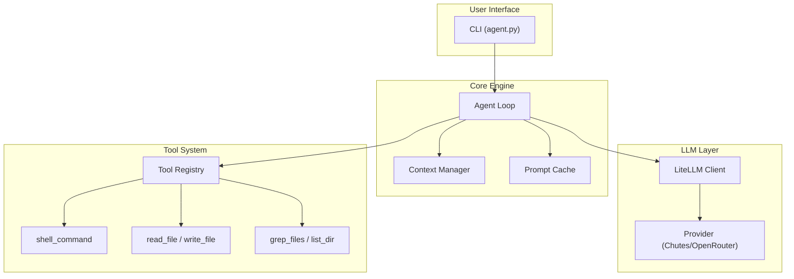

# BaseAgent Documentation

> **Professional documentation for the BaseAgent autonomous coding assistant**

BaseAgent is a high-performance autonomous agent designed for the [Term Challenge](https://term.challenge). It leverages LLM-driven decision making with advanced context management and cost optimization techniques.

---

## Table of Contents

### Getting Started
- [Overview](./overview.md) - What is BaseAgent and core design principles
- [Installation](./installation.md) - Prerequisites and setup instructions
- [Quick Start](./quickstart.md) - Your first task in 5 minutes

### Core Concepts
- [Architecture](./architecture.md) - Technical architecture and system design
- [Configuration](./configuration.md) - All configuration options explained
- [Usage Guide](./usage.md) - Command-line interface and options

### Reference
- [Tools Reference](./tools.md) - Available tools and their parameters
- [Context Management](./context-management.md) - Token management and compaction
- [Best Practices](./best-practices.md) - Optimal usage patterns

### LLM Providers
- [Chutes API Integration](./chutes-integration.md) - Using Chutes as your LLM provider

---

## Quick Navigation

| Document | Description |
|----------|-------------|
| [Overview](./overview.md) | High-level introduction and design principles |
| [Installation](./installation.md) | Step-by-step setup guide |
| [Quick Start](./quickstart.md) | Get running in minutes |
| [Architecture](./architecture.md) | Technical deep-dive with diagrams |
| [Configuration](./configuration.md) | Environment variables and settings |
| [Usage](./usage.md) | CLI commands and examples |
| [Tools](./tools.md) | Complete tools reference |
| [Context Management](./context-management.md) | Memory and token optimization |
| [Best Practices](./best-practices.md) | Tips for optimal performance |
| [Chutes Integration](./chutes-integration.md) | Chutes API setup and usage |

---

## Architecture at a Glance



---

## Key Features

- **Fully Autonomous** - No user confirmation required; makes decisions independently
- **LLM-Driven** - All decisions made by the language model, not hardcoded logic
- **Prompt Caching** - 90%+ cache hit rate for significant cost reduction
- **Context Management** - Intelligent pruning and compaction for long tasks
- **Self-Verification** - Automatic validation before task completion
- **Multi-Provider** - Supports Chutes AI, OpenRouter, and litellm-compatible providers

---

## Project Structure

```
baseagent/
├── agent.py                 # Entry point
├── src/
│   ├── core/
│   │   ├── loop.py          # Main agent loop
│   │   └── compaction.py    # Context management
│   ├── llm/
│   │   └── client.py        # LLM client (litellm)
│   ├── config/
│   │   └── defaults.py      # Configuration
│   ├── tools/               # Tool implementations
│   ├── prompts/
│   │   └── system.py        # System prompt
│   └── output/
│       └── jsonl.py         # JSONL event emission
├── rules/                   # Development guidelines
├── astuces/                 # Implementation techniques
└── docs/                    # This documentation
```

---

## License

MIT License - See [LICENSE](../LICENSE) for details.
