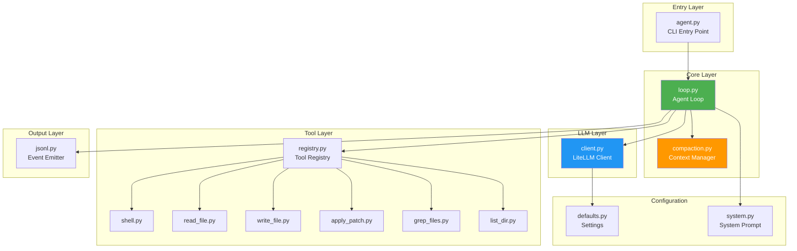
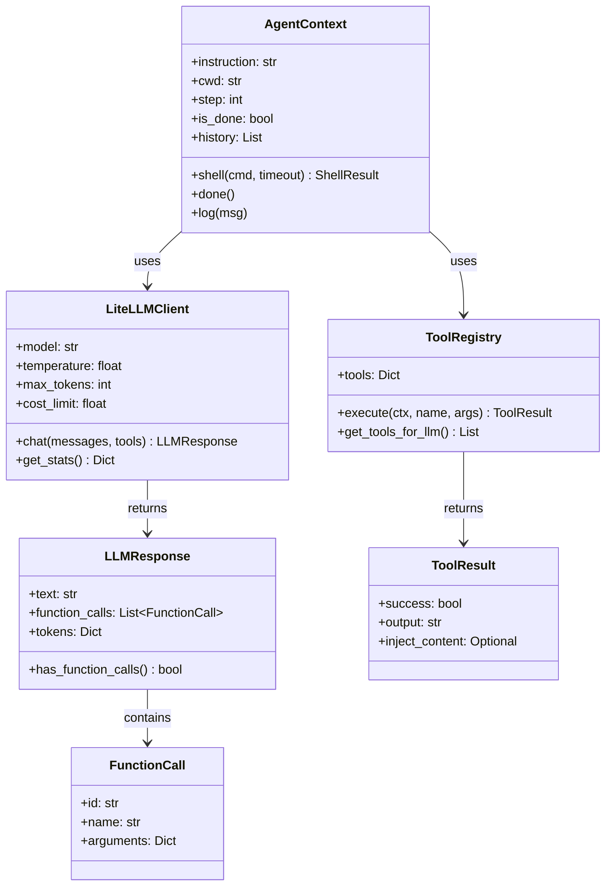
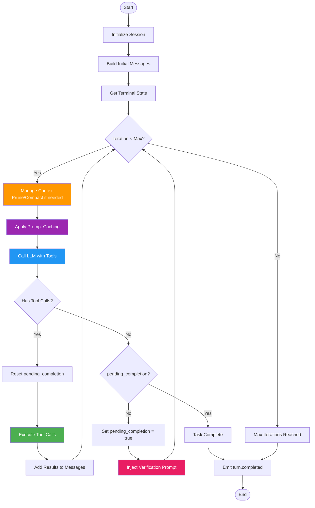
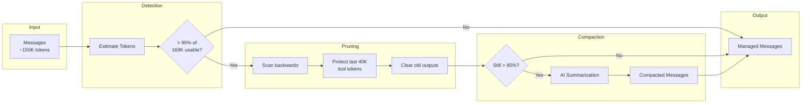
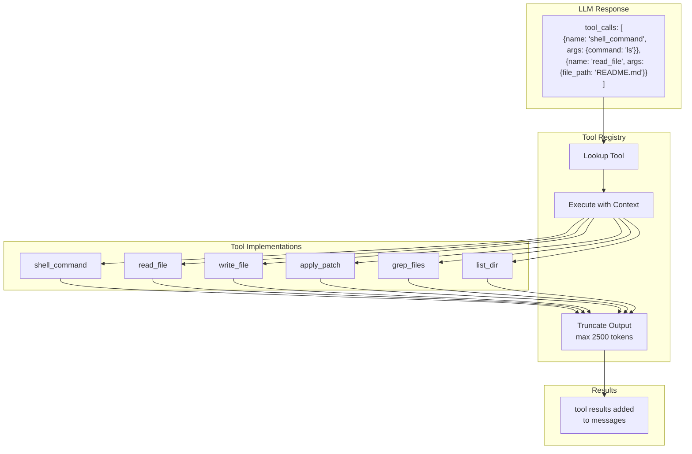
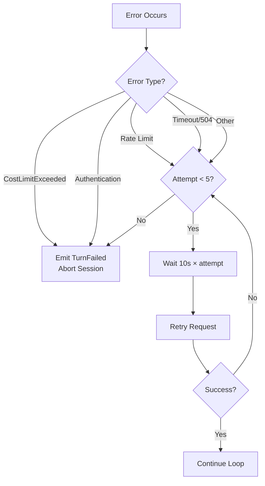

# Technical Architecture

> **Deep dive into BaseAgent's system design, components, and data flow**

## System Overview

BaseAgent follows a modular architecture with clear separation of concerns:



---

## Component Diagram



---

## Agent Loop Workflow

The heart of BaseAgent is the agent loop in `src/core/loop.py`:



---

## Data Flow

### Request Flow

```mermaid
sequenceDiagram
    participant User
    participant Entry as agent.py
    participant Loop as loop.py
    participant Context as compaction.py
    participant Cache as Prompt Cache
    participant LLM as LiteLLM Client
    participant Provider as API Provider
    participant Tools as Tool Registry

    User->>Entry: --instruction "Create hello.txt"
    Entry->>Entry: Initialize AgentContext
    Entry->>Entry: Initialize LiteLLMClient
    Entry->>Loop: run_agent_loop()
    
    Loop->>Loop: Build messages [system, user, state]
    
    rect rgb(255, 240, 220)
        Note over Loop,Provider: Iteration Loop
        Loop->>Context: manage_context(messages)
        Context-->>Loop: Managed messages
        
        Loop->>Cache: apply_caching(messages)
        Cache-->>Loop: Cached messages
        
        Loop->>LLM: chat(messages, tools)
        LLM->>Provider: API Request
        Provider-->>LLM: Response
        LLM-->>Loop: LLMResponse
        
        alt Has tool_calls
            Loop->>Tools: execute(ctx, tool_name, args)
            Tools-->>Loop: ToolResult
            Loop->>Loop: Append to messages
        end
    end
    
    Loop-->>Entry: Complete
    Entry-->>User: JSONL output
```

### Message Structure

Messages accumulate through the session:

```python
messages = [
    # 1. System prompt (stable, cached)
    {"role": "system", "content": SYSTEM_PROMPT},
    
    # 2. User instruction
    {"role": "user", "content": "Create hello.txt with 'Hello World'"},
    
    # 3. Initial state
    {"role": "user", "content": "Current directory:\n```\n...\n```"},
    
    # 4. Assistant response with tool calls
    {
        "role": "assistant",
        "content": "Creating the file...",
        "tool_calls": [
            {"id": "call_1", "type": "function", "function": {...}}
        ]
    },
    
    # 5. Tool result
    {"role": "tool", "tool_call_id": "call_1", "content": "File created"},
    
    # ... continues until completion
]
```

---

## Module Descriptions

### `src/core/loop.py` - Agent Loop

The main orchestration module that:
- Initializes the session and emits JSONL events
- Manages the iterative Observe→Think→Act cycle
- Applies prompt caching for cost optimization
- Handles LLM errors with retry logic
- Triggers self-verification before completion

### `src/core/compaction.py` - Context Manager

Intelligent context management that:
- Estimates token usage (4 chars ≈ 1 token)
- Detects context overflow at 85% of usable window
- Prunes old tool outputs (protects last 40K tokens)
- Runs AI compaction when pruning is insufficient
- Preserves critical information through summarization

### `src/llm/client.py` - LLM Client

LiteLLM-based client that:
- Supports multiple providers (Chutes, OpenRouter, etc.)
- Tracks token usage and costs
- Handles tool/function calling format
- Enforces cost limits
- Provides usage statistics

### `src/tools/registry.py` - Tool Registry

Centralized tool management that:
- Registers all available tools
- Provides tool specs for LLM
- Executes tools with proper context
- Handles tool output truncation
- Manages image injection for `view_image`

### `src/prompts/system.py` - System Prompt

System prompt configuration that:
- Defines agent personality and behavior
- Specifies coding guidelines
- Includes AGENTS.md support
- Configures autonomous operation mode
- Provides environment context

### `src/config/defaults.py` - Configuration

Central configuration containing:
- Model settings (model name, tokens, temperature)
- Context management thresholds
- Tool output limits
- Prompt caching settings
- Execution limits

---

## Context Management Pipeline



---

## Tool Execution Flow



---

## JSONL Event Emission

BaseAgent emits structured JSONL events throughout execution:

```mermaid
sequenceDiagram
    participant Loop as Agent Loop
    participant JSONL as Event Emitter
    participant stdout as Standard Output

    Loop->>JSONL: emit(ThreadStartedEvent)
    JSONL->>stdout: {"type": "thread.started", ...}
    
    Loop->>JSONL: emit(TurnStartedEvent)
    JSONL->>stdout: {"type": "turn.started", ...}
    
    loop Each Tool Call
        Loop->>JSONL: emit(ItemStartedEvent)
        JSONL->>stdout: {"type": "item.started", ...}
        Loop->>JSONL: emit(ItemCompletedEvent)
        JSONL->>stdout: {"type": "item.completed", ...}
    end
    
    Loop->>JSONL: emit(TurnCompletedEvent)
    JSONL->>stdout: {"type": "turn.completed", "usage": {...}}
```

---

## Error Handling Strategy



---

## Next Steps

- [Configuration Reference](./configuration.md) - All settings explained
- [Tools Reference](./tools.md) - Detailed tool documentation
- [Context Management](./context-management.md) - Deep dive into memory management
