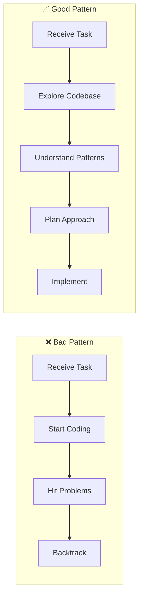
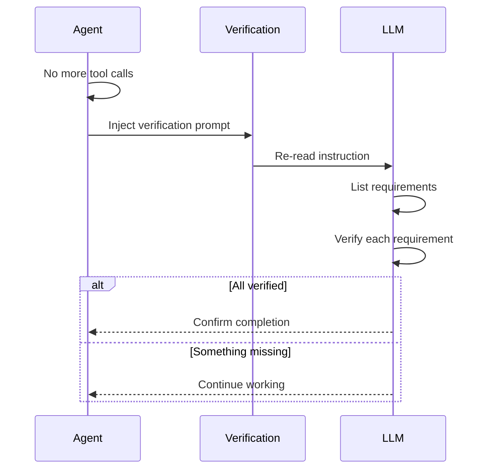
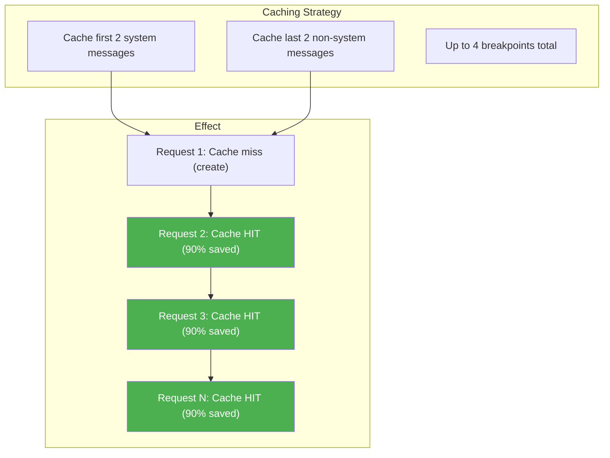
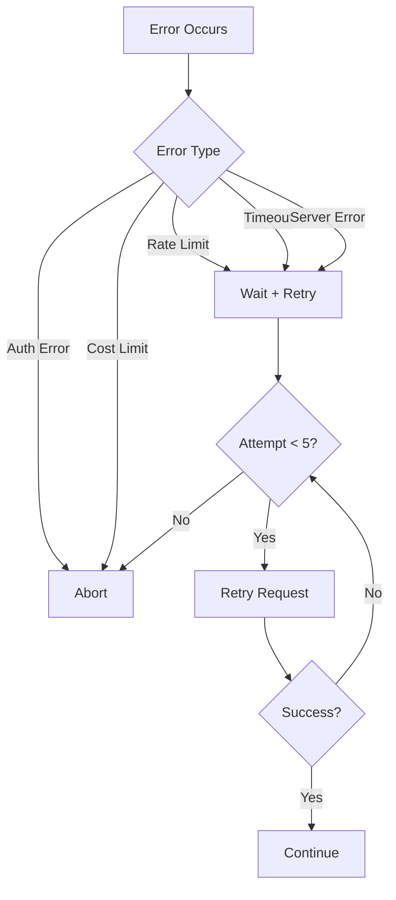

# Best Practices

> **Strategies for optimal performance, cost efficiency, and reliable results**

## Core Principles

BaseAgent follows these fundamental principles:

1. **Explore First** - Always gather context before acting
2. **Iterate** - Never try to solve everything in one shot
3. **Verify** - Double-confirm before completing
4. **Fail Gracefully** - Handle errors and retry
5. **Stay Focused** - Complete exactly what's asked

---

## Explore-First Pattern

Before making any changes, always understand the context:



### Exploration Steps

1. **Read README** - Understand project purpose
2. **List directory** - See project structure
3. **Find similar code** - Match existing patterns
4. **Check tests** - Understand expected behavior
5. **Review AGENTS.md** - Follow project instructions

---

## Self-Verification

BaseAgent automatically verifies work before completion:



### Verification Checklist

The agent automatically asks:
- ✅ Did I read the ENTIRE original instruction?
- ✅ Did I list ALL requirements (explicit and implicit)?
- ✅ Did I run commands to VERIFY each requirement?
- ✅ Did I fix any issues found during verification?

---

## Prompt Caching

Achieve **90%+ cache hit rate** for massive cost savings:



### How It Works

```python
# Messages structure
messages = [
    {"role": "system", "content": "...", "cache_control": {"type": "ephemeral"}},  # ✓ Cached
    {"role": "user", "content": "original instruction"},
    {"role": "assistant", "content": "...", "tool_calls": [...]},
    {"role": "tool", "content": "..."},
    {"role": "assistant", "content": "...", "cache_control": {"type": "ephemeral"}},  # ✓ Cached
    {"role": "user", "content": "verification", "cache_control": {"type": "ephemeral"}},  # ✓ Cached
]
```

### Cost Impact

| Scenario | Cost per 1M tokens |
|----------|-------------------|
| No caching | $3.00 |
| 90% cache hit | $0.30 |
| **Savings** | **90%** |

---

## Cost Optimization

### Set Cost Limits

```bash
export LLM_COST_LIMIT="5.0"  # Max $5 per session
```

### Monitor Usage

Watch the logs for token counts:
```
[14:30:17] [loop] Tokens: 50000 input, 45000 cached, 500 output
```

### Optimize Instructions

```bash
# ❌ Vague (causes exploration loops)
python3 agent.py --instruction "Fix the bugs"

# ✅ Specific (direct action)
python3 agent.py --instruction "Fix the TypeError in src/api/handlers.py:42"
```

### Use Targeted Tools

```bash
# ❌ Wasteful
ls -laR /  # Lists entire filesystem

# ✅ Efficient
list_dir(dir_path="src/", depth=2)
```

---

## Git Hygiene

BaseAgent follows strict git rules:

### ✅ Allowed

- `git status` - Check current state
- `git log` - View history
- `git blame` - Understand code origins
- `git diff` - Review changes
- `git add` - Stage changes (when asked)
- `git commit` - Commit changes (when asked)

### ❌ Forbidden

- `git reset --hard` - Destructive
- `git checkout --` - Loses changes
- Reverting changes you didn't make
- Amending commits without permission
- Pushing without explicit request

### Safe Practices

```bash
# Always check state first
git status

# Review before committing
git diff

# Stage specific files
git add src/specific_file.py

# Never force operations
# ❌ git push --force
```

---

## Writing Effective Instructions

### Be Specific

```bash
# ❌ Too vague
"Fix the code"

# ✅ Specific
"Fix the NullPointerException in UserService.java:85 when user.email is null"
```

### Provide Context

```bash
# ❌ Missing context
"Add authentication"

# ✅ With context
"Add JWT authentication to the /api/users endpoint using the existing AuthService"
```

### Request Verification

```bash
# ✅ Ask for verification
"Create a sorting algorithm and verify it works with [5, 2, 8, 1, 9]"
```

### Break Down Complex Tasks

```bash
# ❌ Too complex for one instruction
"Build a complete e-commerce platform"

# ✅ Incremental
"Create the product catalog data model with name, price, and description fields"
```

---

## Tool Usage Patterns

### Shell Commands

```python
# ✅ Use workdir
{"command": "ls -la", "workdir": "/workspace/src"}

# ❌ Avoid cd chains
{"command": "cd /workspace && cd src && ls"}
```

### File Reading

```python
# ✅ Read specific sections
{"file_path": "large.py", "offset": 100, "limit": 50}

# ❌ Read entire large files
{"file_path": "large.py"}  # May overwhelm context
```

### Searching

```python
# ✅ Use grep_files for discovery
{"pattern": "def calculate", "include": "*.py", "path": "src/"}

# Then read specific files found
{"file_path": "src/billing/calculator.py"}
```

### Editing

```python
# ✅ Use apply_patch for surgical edits
{"patch": "*** Update File: src/utils.py\n@@ def old_func:\n-    old\n+    new"}

# ✅ Use write_file for new files
{"file_path": "new_module.py", "content": "..."}
```

---

## Handling Long Tasks

For complex, multi-step tasks:

### 1. Use update_plan

```python
{
    "steps": [
        {"description": "Analyze existing code", "status": "completed"},
        {"description": "Design new module", "status": "in_progress"},
        {"description": "Implement core logic", "status": "pending"},
        {"description": "Add unit tests", "status": "pending"},
        {"description": "Update documentation", "status": "pending"}
    ]
}
```

### 2. Monitor Context

Watch for compaction events:
```
[compaction] Context overflow detected, managing...
```

### 3. Save Progress

If context compaction occurs, the summary preserves:
- Current progress
- Key decisions
- Remaining work
- Modified files

---

## Error Handling

BaseAgent handles errors gracefully:

### Automatic Retry



### Recovery Strategies

1. **Try alternatives** - If one approach fails, try another
2. **Check documentation** - Read AGENTS.md, README.md
3. **Simplify** - Break complex operations into steps
4. **Report issues** - Note blockers in final message

---

## Performance Tips

### Reduce Iterations

1. Give specific, complete instructions
2. Provide necessary context upfront
3. Avoid vague requirements

### Minimize Token Usage

1. Search before reading entire files
2. Use targeted directory listings
3. Keep tool outputs focused

### Maximize Cache Hits

1. Keep system prompt stable
2. Don't modify early messages
3. Let the agent handle caching automatically

---

## Checklist

Before running the agent:

- [ ] Clear, specific instruction
- [ ] Necessary context provided
- [ ] API key configured
- [ ] Cost limit set appropriately
- [ ] Working directory correct

After completion:

- [ ] Verify output matches requirements
- [ ] Check for any error messages
- [ ] Review modified files
- [ ] Run relevant tests

---

## Next Steps

- [Configuration](./configuration.md) - Tune settings
- [Context Management](./context-management.md) - Memory optimization
- [Tools Reference](./tools.md) - Detailed tool docs
