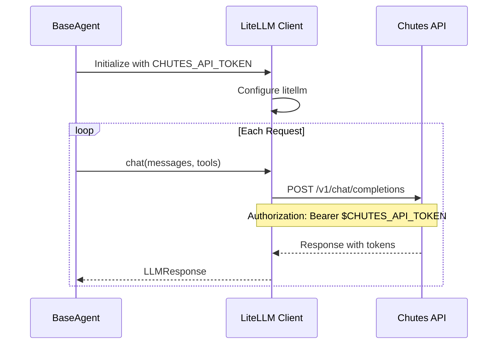
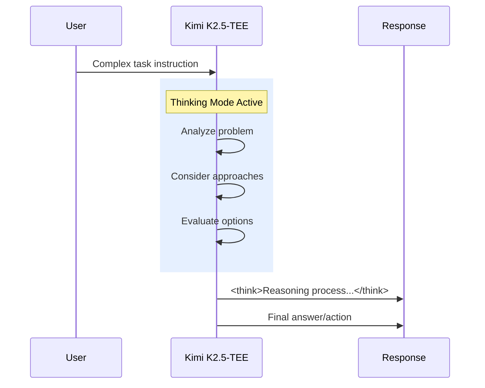
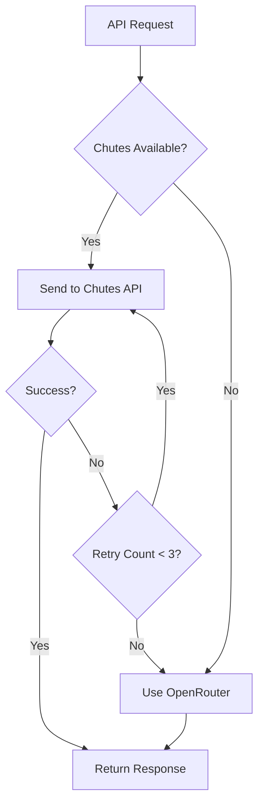

# Chutes API Integration

> **Using Chutes AI as your LLM provider for BaseAgent**

## Overview

[Chutes AI](https://chutes.ai) provides access to advanced language models through a simple API. BaseAgent supports Chutes as a first-class provider, offering access to the **Kimi K2.5-TEE** model with its powerful thinking capabilities.

---

## Chutes API Features

| Feature | Value |
|---------|-------|
| **API Base URL** | `https://llm.chutes.ai/v1` |
| **Default Model** | `moonshotai/Kimi-K2.5-TEE` |
| **Model Parameters** | 1T total, 32B activated |
| **Context Window** | 256K tokens |
| **Thinking Mode** | Enabled by default |

---

## Quick Setup

### Step 1: Get Your API Token

1. Visit [chutes.ai](https://chutes.ai)
2. Create an account or sign in
3. Navigate to API settings
4. Generate an API token

### Step 2: Configure Environment

```bash
# Required: API token
export CHUTES_API_TOKEN="your-token-from-chutes.ai"

# Optional: Explicitly set provider and model
export LLM_PROVIDER="chutes"
export LLM_MODEL="moonshotai/Kimi-K2.5-TEE"
```

### Step 3: Run BaseAgent

```bash
python3 agent.py --instruction "Your task description"
```

---

## Authentication Flow



---

## Model Details: Kimi K2.5-TEE

The **moonshotai/Kimi-K2.5-TEE** model offers:

### Architecture
- **Total Parameters**: 1 Trillion (1T)
- **Activated Parameters**: 32 Billion (32B)
- **Architecture**: Mixture of Experts (MoE)
- **Context Length**: 256,000 tokens

### Thinking Mode

Kimi K2.5-TEE supports a "thinking mode" where the model shows its reasoning process:



### Temperature Settings

| Mode | Temperature | Top-p | Description |
|------|-------------|-------|-------------|
| **Thinking** | 1.0 | 0.95 | More exploratory reasoning |
| **Instant** | 0.6 | 0.95 | Faster, more deterministic |

---

## Configuration Options

### Basic Configuration

```python
# src/config/defaults.py
CONFIG = {
    "model": os.environ.get("LLM_MODEL", "moonshotai/Kimi-K2.5-TEE"),
    "provider": "chutes",
    "temperature": 1.0,  # For thinking mode
    "max_tokens": 16384,
}
```

### Environment Variables

| Variable | Required | Default | Description |
|----------|----------|---------|-------------|
| `CHUTES_API_TOKEN` | Yes | - | API token from chutes.ai |
| `LLM_PROVIDER` | No | `openrouter` | Set to `chutes` |
| `LLM_MODEL` | No | `moonshotai/Kimi-K2.5-TEE` | Model identifier |
| `LLM_COST_LIMIT` | No | `10.0` | Max cost in USD |

---

## Thinking Mode Processing

When thinking mode is enabled, responses include `<think>` tags:

```xml
<think>
The user wants to create a file with specific content.
I should:
1. Check if the file already exists
2. Create the file with the requested content
3. Verify the file was created correctly
</think>

I'll create the file for you now.
```

BaseAgent can be configured to:
- **Parse and strip** the thinking tags (show only final answer)
- **Keep** the thinking content (useful for debugging)
- **Log** thinking to stderr while showing final answer

### Parsing Example

```python
import re

def parse_thinking(response_text: str) -> tuple[str, str]:
    """Extract thinking and final response."""
    think_pattern = r'<think>(.*?)</think>'
    match = re.search(think_pattern, response_text, re.DOTALL)
    
    if match:
        thinking = match.group(1).strip()
        final = re.sub(think_pattern, '', response_text, flags=re.DOTALL).strip()
        return thinking, final
    
    return "", response_text
```

---

## API Request Format

Chutes API follows OpenAI-compatible format:

```bash
curl -X POST https://llm.chutes.ai/v1/chat/completions \
  -H "Authorization: Bearer $CHUTES_API_TOKEN" \
  -H "Content-Type: application/json" \
  -d '{
    "model": "moonshotai/Kimi-K2.5-TEE",
    "messages": [
      {"role": "system", "content": "You are a helpful assistant."},
      {"role": "user", "content": "Hello!"}
    ],
    "max_tokens": 1024,
    "temperature": 1.0,
    "top_p": 0.95
  }'
```

---

## Fallback to OpenRouter

If Chutes is unavailable, BaseAgent can fall back to OpenRouter:



### Configuration for Fallback

```bash
# Primary: Chutes
export CHUTES_API_TOKEN="..."
export LLM_PROVIDER="chutes"

# Fallback: OpenRouter
export OPENROUTER_API_KEY="..."
```

### Switching Providers

```bash
# Switch to OpenRouter
export LLM_PROVIDER="openrouter"
export LLM_MODEL="openrouter/anthropic/claude-sonnet-4-20250514"

# Switch back to Chutes
export LLM_PROVIDER="chutes"
export LLM_MODEL="moonshotai/Kimi-K2.5-TEE"
```

---

## Cost Considerations

### Pricing (Approximate)

| Metric | Cost |
|--------|------|
| Input tokens | Varies by model |
| Output tokens | Varies by model |
| Cached input | Reduced rate |

### Cost Management

```bash
# Set cost limit
export LLM_COST_LIMIT="5.0"  # Max $5.00 per session
```

BaseAgent tracks costs and will abort if the limit is exceeded:

```python
# In src/llm/client.py
if self._total_cost >= self.cost_limit:
    raise CostLimitExceeded(
        f"Cost limit exceeded: ${self._total_cost:.4f}",
        used=self._total_cost,
        limit=self.cost_limit,
    )
```

---

## Troubleshooting

### Authentication Errors

```
LLMError: authentication_error
```

**Solution**: Verify your token is correct and exported:

```bash
echo $CHUTES_API_TOKEN  # Should show your token
export CHUTES_API_TOKEN="correct-token"
```

### Rate Limiting

```
LLMError: rate_limit
```

**Solution**: BaseAgent automatically retries with exponential backoff. You can also:
- Wait a few minutes before retrying
- Reduce request frequency
- Check your API plan limits

### Model Not Found

```
LLMError: Model 'xyz' not found
```

**Solution**: Use the correct model identifier:

```bash
export LLM_MODEL="moonshotai/Kimi-K2.5-TEE"
```

### Connection Timeouts

```
LLMError: timeout
```

**Solution**: BaseAgent retries automatically. If persistent:
- Check your internet connection
- Verify Chutes API status
- Consider using OpenRouter as fallback

---

## Integration with LiteLLM

BaseAgent uses [LiteLLM](https://docs.litellm.ai/) for provider abstraction:

```python
# src/llm/client.py
import litellm

# For Chutes, configure base URL
litellm.api_base = "https://llm.chutes.ai/v1"

# Make request
response = litellm.completion(
    model="moonshotai/Kimi-K2.5-TEE",
    messages=messages,
    api_key=os.environ.get("CHUTES_API_TOKEN"),
)
```

---

## Best Practices

### For Optimal Performance

1. **Enable thinking mode** for complex reasoning tasks
2. **Use appropriate temperature** (1.0 for exploration, 0.6 for precision)
3. **Leverage the 256K context** for large codebases
4. **Monitor costs** with `LLM_COST_LIMIT`

### For Reliability

1. **Set up fallback** to OpenRouter
2. **Handle rate limits** gracefully (automatic in BaseAgent)
3. **Log responses** for debugging complex tasks

### For Cost Efficiency

1. **Enable prompt caching** (reduces costs by 90%)
2. **Use context management** to avoid token waste
3. **Set reasonable cost limits** for testing

---

## Next Steps

- [Configuration Reference](./configuration.md) - All settings explained
- [Best Practices](./best-practices.md) - Optimization tips
- [Usage Guide](./usage.md) - Command-line options
