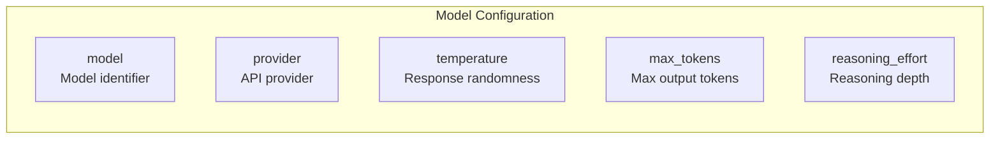
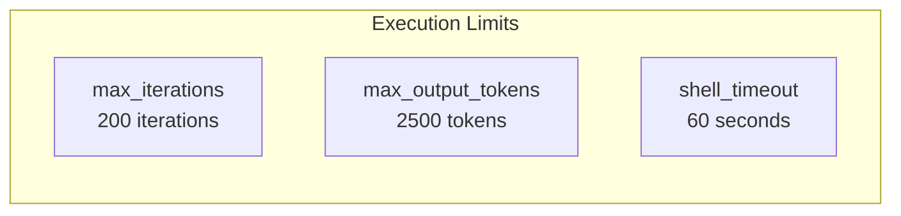
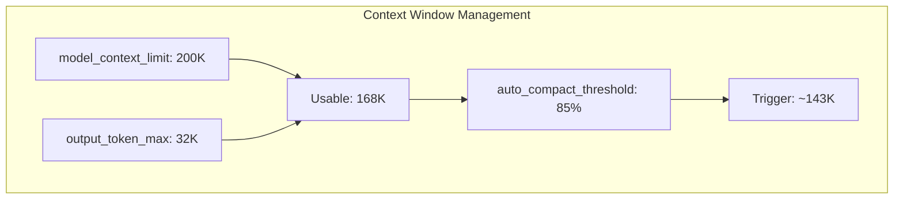
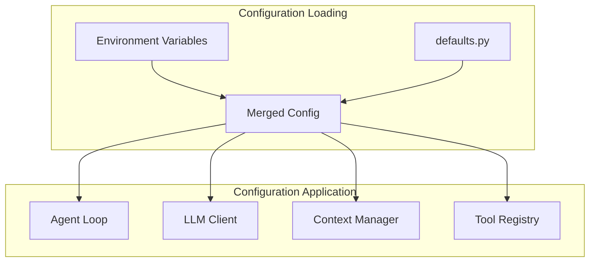

# Configuration Reference

> **Complete guide to all configuration options in BaseAgent**

## Overview

BaseAgent configuration is centralized in `src/config/defaults.py`. Settings can be customized via environment variables or by modifying the configuration file directly.

---

## Configuration File

The main configuration is stored in the `CONFIG` dictionary:

```python
# src/config/defaults.py
CONFIG = {
    # Model Settings
    "model": "openrouter/anthropic/claude-sonnet-4-20250514",
    "provider": "openrouter",
    "temperature": 0.0,
    "max_tokens": 16384,
    "reasoning_effort": "none",
    
    # Agent Execution
    "max_iterations": 200,
    "max_output_tokens": 2500,
    "shell_timeout": 60,
    
    # Context Management
    "model_context_limit": 200_000,
    "output_token_max": 32_000,
    "auto_compact_threshold": 0.85,
    "prune_protect": 40_000,
    "prune_minimum": 20_000,
    
    # Prompt Caching
    "cache_enabled": True,
    
    # Execution Flags
    "bypass_approvals": True,
    "bypass_sandbox": True,
    "skip_git_check": True,
    "unified_exec": True,
    "json_output": True,
    
    # Completion
    "require_completion_confirmation": False,
}
```

---

## Environment Variables

### LLM Provider Settings

| Variable | Default | Description |
|----------|---------|-------------|
| `LLM_MODEL` | `openrouter/anthropic/claude-sonnet-4-20250514` | Model identifier |
| `LLM_PROVIDER` | `openrouter` | Provider name (`chutes`, `openrouter`, etc.) |
| `LLM_COST_LIMIT` | `10.0` | Maximum cost in USD before aborting |

### API Keys

| Variable | Provider | Description |
|----------|----------|-------------|
| `CHUTES_API_TOKEN` | Chutes AI | Token from chutes.ai |
| `OPENROUTER_API_KEY` | OpenRouter | API key from openrouter.ai |
| `ANTHROPIC_API_KEY` | Anthropic | Direct Anthropic API key |
| `OPENAI_API_KEY` | OpenAI | OpenAI API key |

### Example Setup

```bash
# For Chutes AI
export CHUTES_API_TOKEN="your-token"
export LLM_PROVIDER="chutes"
export LLM_MODEL="moonshotai/Kimi-K2.5-TEE"

# For OpenRouter
export OPENROUTER_API_KEY="sk-or-v1-..."
export LLM_MODEL="openrouter/anthropic/claude-sonnet-4-20250514"
```

---

## Configuration Sections

### Model Settings



| Setting | Type | Default | Description |
|---------|------|---------|-------------|
| `model` | `str` | `openrouter/anthropic/claude-sonnet-4-20250514` | Full model identifier with provider prefix |
| `provider` | `str` | `openrouter` | LLM provider name |
| `temperature` | `float` | `0.0` | Response randomness (0 = deterministic) |
| `max_tokens` | `int` | `16384` | Maximum tokens in LLM response |
| `reasoning_effort` | `str` | `none` | Reasoning depth: `none`, `minimal`, `low`, `medium`, `high`, `xhigh` |

### Agent Execution Settings



| Setting | Type | Default | Description |
|---------|------|---------|-------------|
| `max_iterations` | `int` | `200` | Maximum loop iterations before stopping |
| `max_output_tokens` | `int` | `2500` | Max tokens for tool output truncation |
| `shell_timeout` | `int` | `60` | Shell command timeout in seconds |

### Context Management



| Setting | Type | Default | Description |
|---------|------|---------|-------------|
| `model_context_limit` | `int` | `200000` | Total model context window (tokens) |
| `output_token_max` | `int` | `32000` | Tokens reserved for output |
| `auto_compact_threshold` | `float` | `0.85` | Trigger compaction at this % of usable context |
| `prune_protect` | `int` | `40000` | Protect this many tokens of recent tool output |
| `prune_minimum` | `int` | `20000` | Only prune if recovering at least this many tokens |

### Prompt Caching

| Setting | Type | Default | Description |
|---------|------|---------|-------------|
| `cache_enabled` | `bool` | `True` | Enable Anthropic prompt caching |

> **Note**: Prompt caching requires minimum token thresholds per breakpoint:
> - Claude Opus 4.5 on Bedrock: 4096 tokens
> - Claude Sonnet/other: 1024 tokens

### Execution Flags

| Setting | Type | Default | Description |
|---------|------|---------|-------------|
| `bypass_approvals` | `bool` | `True` | Skip user approval prompts |
| `bypass_sandbox` | `bool` | `True` | Bypass sandbox restrictions |
| `skip_git_check` | `bool` | `True` | Skip git repository validation |
| `unified_exec` | `bool` | `True` | Enable unified execution mode |
| `json_output` | `bool` | `True` | Always emit JSONL output |
| `require_completion_confirmation` | `bool` | `False` | Require double-confirm before completing |

---

## Provider-Specific Configuration

### Chutes AI

```python
# Environment
CHUTES_API_TOKEN="your-token"
LLM_PROVIDER="chutes"
LLM_MODEL="moonshotai/Kimi-K2.5-TEE"

# Model features
# - 1T parameters, 32B activated
# - 256K context window
# - Thinking mode enabled by default
# - Temperature: 1.0 (thinking), 0.6 (instant)
```

### OpenRouter

```python
# Environment
OPENROUTER_API_KEY="sk-or-v1-..."
LLM_MODEL="openrouter/anthropic/claude-sonnet-4-20250514"

# Requires openrouter/ prefix for litellm
```

### Direct Anthropic

```python
# Environment
ANTHROPIC_API_KEY="sk-ant-..."
LLM_MODEL="claude-3-5-sonnet-20241022"

# No prefix needed for direct API
```

---

## Configuration Workflow



---

## Computed Values

Some values are computed from configuration:

```python
# Usable context window
usable_context = model_context_limit - output_token_max
# Default: 200,000 - 32,000 = 168,000 tokens

# Compaction trigger threshold
compaction_trigger = usable_context * auto_compact_threshold
# Default: 168,000 * 0.85 = 142,800 tokens

# Token estimation
chars_per_token = 4  # Heuristic
tokens = len(text) // 4
```

---

## Best Practices

### For Cost Optimization

```bash
# Lower cost limit for testing
export LLM_COST_LIMIT="1.0"

# Use smaller context for simple tasks
# (edit defaults.py)
"model_context_limit": 100_000
```

### For Long Tasks

```bash
# Increase iterations
# (edit defaults.py)
"max_iterations": 500

# Lower compaction threshold for aggressive memory management
"auto_compact_threshold": 0.70
```

### For Debugging

```bash
# Disable caching to see full API calls
# (edit defaults.py)
"cache_enabled": False

# Increase output limits for more context
"max_output_tokens": 5000
```

---

## Next Steps

- [Chutes Integration](./chutes-integration.md) - Configure Chutes API
- [Context Management](./context-management.md) - Understand memory management
- [Best Practices](./best-practices.md) - Optimization tips
