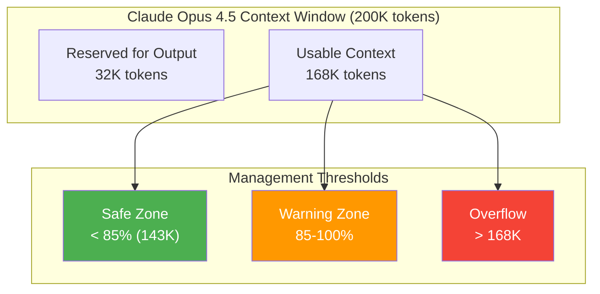
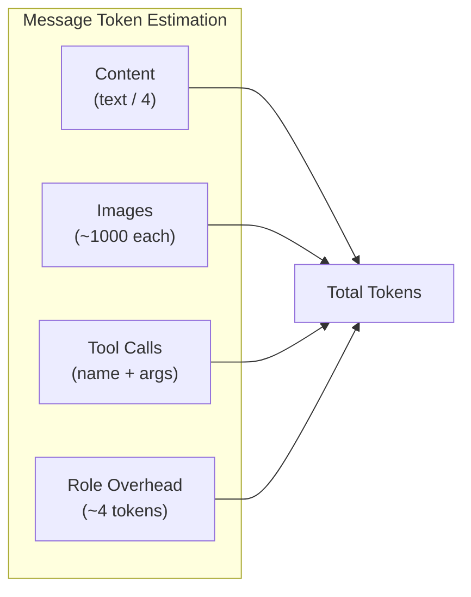
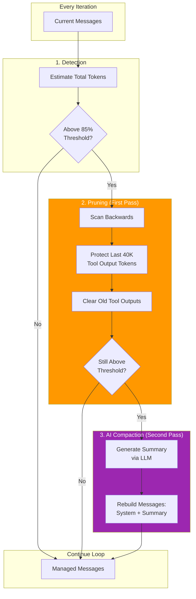
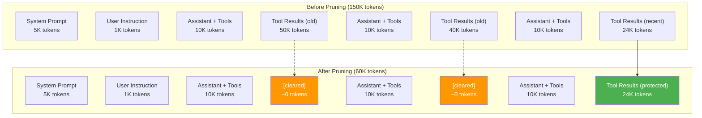
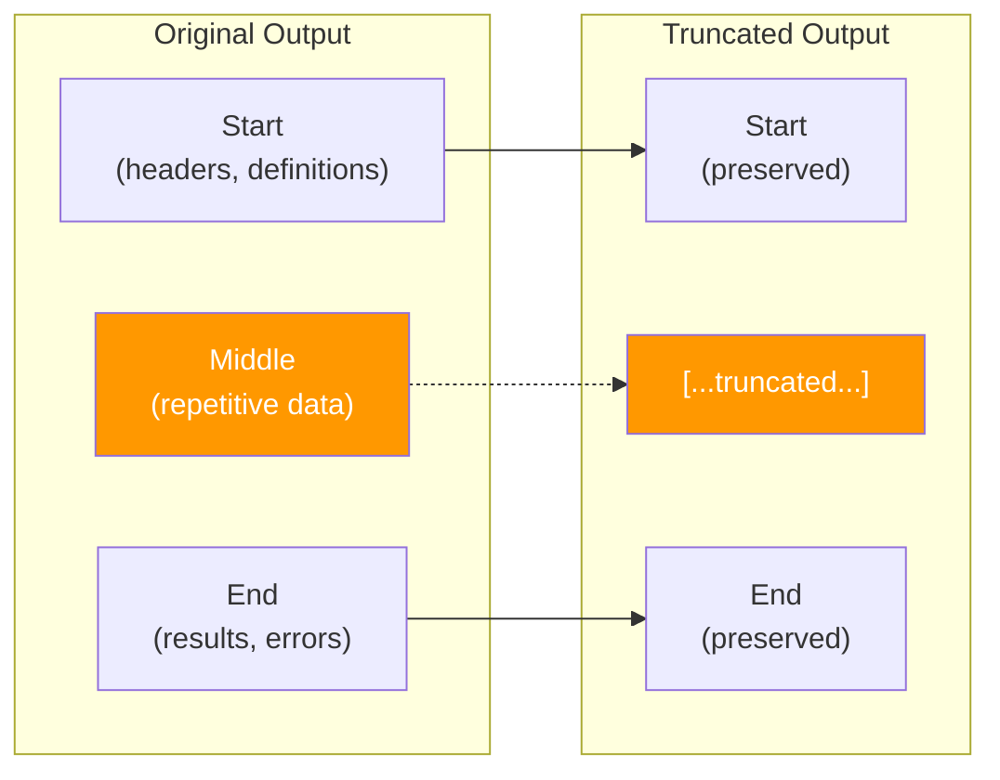

# Context Management

> **How BaseAgent manages memory and prevents token overflow**

## Why Context Management Matters

Large Language Models have finite context windows. Without proper management:
- "Context too long" errors terminate sessions
- Critical information gets lost
- Response quality degrades
- Costs increase unnecessarily

The agent implements sophisticated context management.

---

## Context Window Overview



### Key Numbers

| Metric | Value | Description |
|--------|-------|-------------|
| Total context | 200,000 | Model's full context window |
| Output reserve | 32,000 | Reserved for LLM response |
| Usable context | 168,000 | Available for messages |
| Compaction threshold | 85% | Trigger at 142,800 tokens |
| Prune protect | 40,000 | Recent tool output to keep |
| Prune minimum | 20,000 | Minimum savings to prune |

---

## Token Estimation

BaseAgent estimates tokens using a simple heuristic:

```python
# 1 token ≈ 4 characters
def estimate_tokens(text: str) -> int:
    return len(text) // 4
```

### Message Token Components



---

## Context Management Pipeline



---

## Stage 1: Tool Output Pruning

The first defense against context overflow is pruning old tool outputs.

### Strategy

1. Scan messages **backwards** (most recent first)
2. Skip the first 2 user turns (most recent)
3. Accumulate tool output tokens
4. After 40K tokens accumulated, mark older outputs for pruning
5. Only prune if savings exceed 20K tokens

### Implementation

```python
def prune_old_tool_outputs(messages, protect_last_turns=2):
    total = 0  # Total tool output tokens seen
    pruned = 0  # Tokens to be pruned
    to_prune = []
    turns = 0
    
    for i in range(len(messages) - 1, -1, -1):
        msg = messages[i]
        
        if msg["role"] == "user":
            turns += 1
        
        if turns < protect_last_turns:
            continue
        
        if msg["role"] == "tool":
            content = msg.get("content", "")
            estimate = len(content) // 4
            total += estimate
            
            if total > PRUNE_PROTECT:  # 40K
                pruned += estimate
                to_prune.append(i)
    
    if pruned > PRUNE_MINIMUM:  # 20K
        # Replace content with marker
        for idx in to_prune:
            messages[idx]["content"] = "[Old tool result content cleared]"
    
    return messages
```

### Visual Example



---

## Stage 2: AI Compaction

When pruning isn't enough, BaseAgent uses the LLM to summarize the conversation.

### Compaction Process

```mermaid
sequenceDiagram
    participant Loop as Agent Loop
    participant Compact as Compaction
    participant LLM as LLM API

    Loop->>Compact: Context still too large
    Compact->>Compact: Add compaction prompt
    Compact->>LLM: Request summary
    LLM-->>Compact: Summary response
    Compact->>Compact: Build new messages
    Compact-->>Loop: [System, Summary]
```

### Compaction Prompt

```python
COMPACTION_PROMPT = """
You are performing a CONTEXT CHECKPOINT COMPACTION. 
Create a handoff summary for another LLM that will resume the task.

Include:
- Current progress and key decisions made
- Important context, constraints, or user preferences
- What remains to be done (clear next steps)
- Any critical data, examples, or references needed to continue
- Which files were modified and how
- Any errors encountered and how they were resolved

Be concise, structured, and focused on helping the next LLM 
seamlessly continue the work. Use bullet points and clear sections.
"""
```

### Result

The compacted messages are:

```python
compacted = [
    {"role": "system", "content": original_system_prompt},
    {"role": "user", "content": SUMMARY_PREFIX + llm_summary},
]
```

### Summary Prefix

```python
SUMMARY_PREFIX = """
Another language model started to solve this problem and produced 
a summary of its thinking process. You also have access to the state 
of the tools that were used. Use this to build on the work that has 
already been done and avoid duplicating work.

Here is the summary from the previous context:

"""
```

---

## Middle-Out Truncation

For individual tool outputs, BaseAgent uses middle-out truncation:



### Implementation

```python
def middle_out_truncate(text: str, max_tokens: int = 2500) -> str:
    max_chars = max_tokens * 4  # 4 chars per token
    
    if len(text) <= max_chars:
        return text
    
    keep = max_chars // 2 - 50  # Room for marker
    return f"{text[:keep]}\n\n[...truncated...]\n\n{text[-keep:]}"
```

### Why Middle-Out?

| Section | Contains | Value |
|---------|----------|-------|
| **Start** | Headers, imports, definitions | High |
| **Middle** | Repetitive data, logs | Low |
| **End** | Results, errors, summaries | High |

---

## Configuration Options

| Setting | Default | Description |
|---------|---------|-------------|
| `model_context_limit` | 200,000 | Total context window |
| `output_token_max` | 32,000 | Reserved for output |
| `auto_compact_threshold` | 0.85 | Trigger threshold |
| `prune_protect` | 40,000 | Recent tool tokens to keep |
| `prune_minimum` | 20,000 | Minimum savings to prune |
| `max_output_tokens` | 2,500 | Per-tool output limit |

### Tuning Guidelines

**For Long Tasks:**
```python
"auto_compact_threshold": 0.70,  # More aggressive
"prune_protect": 30_000,          # Protect less
```

**For Complex Tasks (need more context):**
```python
"auto_compact_threshold": 0.90,  # Less aggressive
"prune_protect": 60_000,          # Protect more
```

---

## Monitoring Context Usage

BaseAgent logs context status each iteration:

```
[14:30:16] [compaction] Context: 45000 tokens (26.8% of 168000)
[14:35:22] [compaction] Context: 125000 tokens (74.4% of 168000)
[14:38:45] [compaction] Context: 148000 tokens (88.1% of 168000)
[14:38:45] [compaction] Context overflow detected, managing...
[14:38:45] [compaction] Prune scan: 95000 total tokens, 55000 prunable
[14:38:45] [compaction] Pruning 12 tool outputs, recovering ~55000 tokens
[14:38:46] [compaction] Pruning sufficient: 148000 -> 93000 tokens
```

---

## Best Practices

### 1. Keep Tool Outputs Focused

```bash
# ❌ Too much output
ls -laR /  # Lists entire filesystem

# ✅ Targeted
ls -la /workspace/src/  # Just what's needed
```

### 2. Use Appropriate Search Patterns

```bash
# ❌ Too broad
grep "function"  # Matches everything

# ✅ Specific
grep "def calculate_total" src/billing.py
```

### 3. Read Sections, Not Entire Files

```json
// ❌ Entire large file
{"name": "read_file", "arguments": {"file_path": "huge.py"}}

// ✅ Specific section
{"name": "read_file", "arguments": {"file_path": "huge.py", "offset": 100, "limit": 50}}
```

### 4. Monitor Long Sessions

For tasks exceeding 50 iterations, watch for:
- Repeated compaction events
- Context oscillating near threshold
- Loss of important context after compaction

---

## Next Steps

- [Best Practices](./best-practices.md) - Optimization strategies
- [Configuration](./configuration.md) - Tuning options
- [Architecture](./architecture.md) - System design
