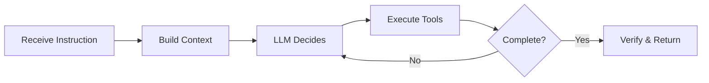
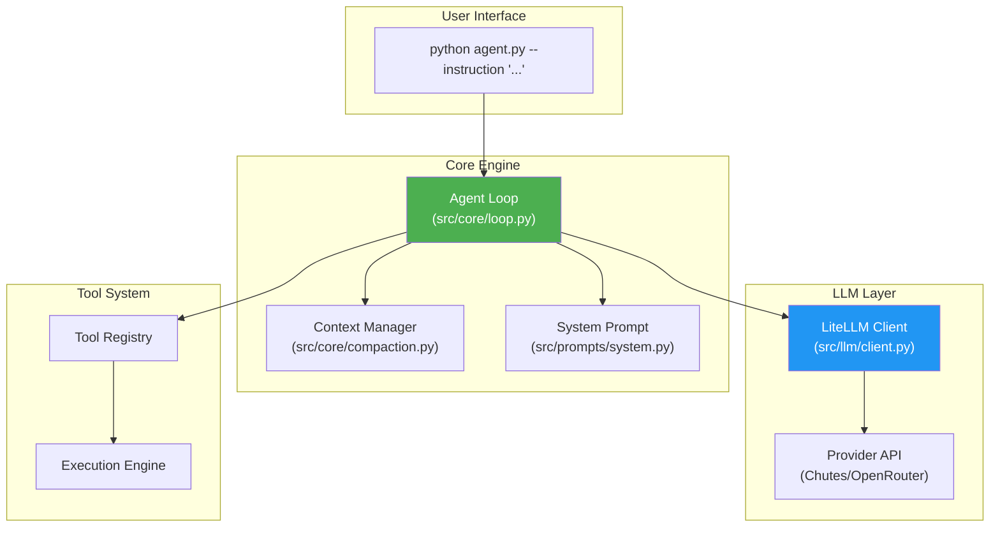

# BaseAgent Overview

> **A high-performance autonomous coding agent built for generalist problem-solving**

## What is BaseAgent?

BaseAgent is an autonomous coding agent designed for the [Term Challenge](https://term.challenge). Unlike traditional scripted automation, BaseAgent uses Large Language Models (LLMs) to reason about tasks and make decisions dynamically.

The agent receives natural language instructions and autonomously:
- Explores the codebase
- Plans and executes solutions
- Validates its own work
- Handles errors and edge cases

---

## Core Design Principles

### 1. No Hardcoding

BaseAgent follows the **Golden Rule**: all decisions are made by the LLM, not by conditional logic.

```python
# ❌ FORBIDDEN - Hardcoded task routing
if "file" in instruction:
    create_file()
elif "compile" in instruction:
    compile_code()

# ✅ REQUIRED - LLM-driven decisions
response = llm.chat(messages, tools=tools)
execute(response.tool_calls)
```

### 2. Single Code Path

Every task, regardless of complexity or domain, flows through the same agent loop:



### 3. Iterative Execution

BaseAgent never tries to solve everything in one shot. Instead, it:
- Observes the current state
- Thinks about the next step
- Acts by calling tools
- Repeats until the task is complete

### 4. Self-Verification

Before declaring a task complete, the agent automatically:
1. Re-reads the original instruction
2. Lists all requirements (explicit and implicit)
3. Verifies each requirement with actual commands
4. Only completes if all verifications pass

---

## High-Level Architecture



---

## Key Features

### Autonomous Operation

BaseAgent runs in **fully autonomous mode**:
- No user confirmations required
- Makes reasonable decisions when faced with ambiguity
- Handles errors by trying alternative approaches
- Never asks questions - just executes

### Prompt Caching

Achieves **90%+ cache hit rate** using Anthropic's prompt caching:
- System prompt cached for stability
- Last 2 messages cached to extend prefix
- Reduces API costs by 90%

### Context Management

Intelligent memory management for long tasks:
- Token-based overflow detection
- Tool output pruning (protects recent outputs)
- AI-powered compaction when needed
- Middle-out truncation for large outputs

### Comprehensive Tooling

Eight specialized tools for coding tasks:

| Tool | Purpose |
|------|---------|
| `shell_command` | Execute shell commands |
| `read_file` | Read files with line numbers |
| `write_file` | Create or overwrite files |
| `apply_patch` | Surgical file modifications |
| `grep_files` | Fast file content search |
| `list_dir` | Directory exploration |
| `view_image` | Image analysis |
| `update_plan` | Progress tracking |

---

## Workflow Overview

```mermaid
sequenceDiagram
    participant User
    participant CLI as agent.py
    participant Loop as Agent Loop
    participant LLM as LLM (Chutes/OpenRouter)
    participant Tools as Tool Registry

    User->>CLI: python agent.py --instruction "..."
    CLI->>Loop: Initialize session
    
    loop Until task complete
        Loop->>Loop: Manage context (prune/compact)
        Loop->>Loop: Apply prompt caching
        Loop->>LLM: Send messages + tools
        LLM-->>Loop: Response (text + tool_calls)
        
        alt Has tool calls
            Loop->>Tools: Execute tool calls
            Tools-->>Loop: Tool results
        else No tool calls
            Loop->>Loop: Self-verification check
        end
    end
    
    Loop-->>CLI: Task complete
    CLI-->>User: JSONL output
```

---

## What Makes BaseAgent a "Generalist"?

| Characteristic | Description |
|----------------|-------------|
| **Single code path** | Same logic handles ALL tasks |
| **LLM-driven decisions** | LLM chooses actions, not if-statements |
| **No task keywords** | Zero references to specific task content |
| **Iterative execution** | Observe → Think → Act loop |

### The Generalist Test

Ask yourself: *"Would this code behave differently if I changed the task instruction?"*

If **YES** and it's not because of LLM reasoning → it's hardcoding → **FORBIDDEN**

---

## Design Philosophy

BaseAgent is built on these principles:

1. **Explore First** - Always gather context before acting
2. **Iterate** - Never try to do everything in one shot
3. **Verify** - Double-confirm before completing
4. **Fail Gracefully** - Handle errors and retry
5. **Stay Focused** - Complete the task, nothing more

---

## Next Steps

- [Installation Guide](./installation.md) - Set up BaseAgent
- [Quick Start](./quickstart.md) - Run your first task
- [Architecture](./architecture.md) - Deep dive into the system design
