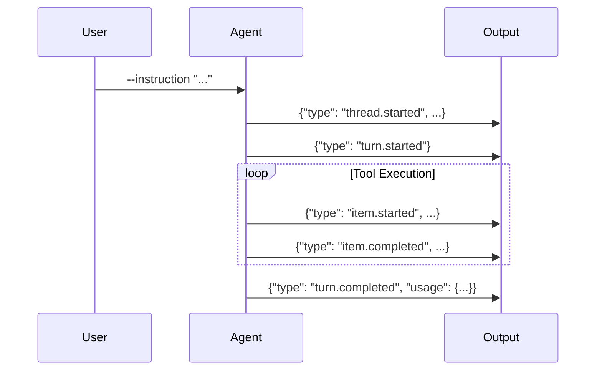
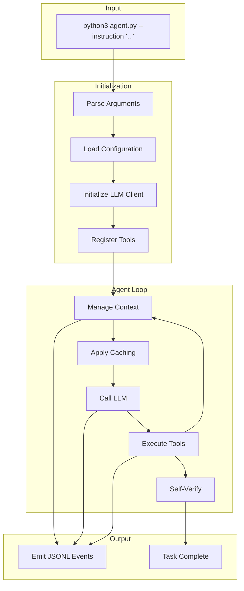

# Quick Start Guide

> **Get BaseAgent running in 5 minutes**

## Prerequisites

Before starting, ensure you have:
- Python 3.9+ installed
- An LLM API key (Chutes, OpenRouter, or Anthropic)
- BaseAgent installed (see [Installation](./installation.md))

---

## Step 1: Set Up Your API Key

Choose your provider and set the environment variable:

```bash
# For Chutes AI (recommended)
export CHUTES_API_TOKEN="your-token-from-chutes.ai"

# OR for OpenRouter
export OPENROUTER_API_KEY="sk-or-v1-..."
```

---

## Step 2: Run Your First Task

Navigate to the BaseAgent directory and run:

```bash
python3 agent.py --instruction "Create a file called hello.txt with the content 'Hello, World!'"
```

### Expected Output

You'll see JSONL events as the agent works:

```json
{"type": "thread.started", "thread_id": "sess_1234567890"}
{"type": "turn.started"}
{"type": "item.started", "item": {"type": "command_execution", "command": "write_file"}}
{"type": "item.completed", "item": {"type": "command_execution", "status": "completed"}}
{"type": "turn.completed", "usage": {"input_tokens": 5000, "output_tokens": 200}}
```

And the file `hello.txt` will be created:

```bash
cat hello.txt
# Output: Hello, World!
```

---

## Step 3: Try More Examples

### Example: Explore a Codebase

```bash
python3 agent.py --instruction "Explore this repository and describe its structure"
```

### Example: Find and Read Files

```bash
python3 agent.py --instruction "Find all Python files and show me the main entry point"
```

### Example: Create a Simple Script

```bash
python3 agent.py --instruction "Create a Python script that prints the Fibonacci sequence up to 100"
```

### Example: Modify Existing Code

```bash
python3 agent.py --instruction "Add a docstring to all functions in src/core/loop.py"
```

---

## Understanding the Output

BaseAgent emits JSONL (JSON Lines) format for machine-readable output:



### Key Event Types

| Event | Description |
|-------|-------------|
| `thread.started` | Session begins with unique ID |
| `turn.started` | Agent begins processing |
| `item.started` | Tool execution begins |
| `item.completed` | Tool execution finished |
| `turn.completed` | Agent finished with usage stats |
| `turn.failed` | Error occurred |

---

## Quick Command Reference

```bash
# Basic usage
python3 agent.py --instruction "Your task description"

# With environment variables inline
CHUTES_API_TOKEN="..." python3 agent.py --instruction "..."

# Redirect output to file
python3 agent.py --instruction "..." > output.jsonl 2>&1
```

---

## Agent Workflow

Here's what happens when you run a task:



---

## Tips for Effective Instructions

### Be Specific

```bash
# ❌ Too vague
python3 agent.py --instruction "Fix the bug"

# ✅ Specific
python3 agent.py --instruction "Fix the TypeError in src/utils.py line 42 where x is None"
```

### Provide Context

```bash
# ❌ Missing context
python3 agent.py --instruction "Add tests"

# ✅ With context
python3 agent.py --instruction "Add unit tests for the calculate_total function in src/billing.py"
```

### Request Verification

```bash
# ✅ Ask for verification
python3 agent.py --instruction "Create a Python script for sorting and verify it works with sample data"
```

---

## Troubleshooting

### Agent Not Finding Files

The agent starts in the current directory. Ensure you're in the right location:

```bash
pwd  # Check current directory
ls   # List files
cd /path/to/project
python3 /path/to/baseagent/agent.py --instruction "..."
```

### API Rate Limits

If you hit rate limits, the agent will automatically retry with exponential backoff. You can also:

```bash
# Set a cost limit
export LLM_COST_LIMIT="5.0"
```

### Long-Running Tasks

For complex tasks, the agent may iterate many times. Monitor progress through the JSONL output:

```bash
python3 agent.py --instruction "..." 2>&1 | grep "item.completed"
```

---

## Next Steps

- [Usage Guide](./usage.md) - Detailed command-line options
- [Configuration](./configuration.md) - Customize behavior
- [Tools Reference](./tools.md) - Available tools
- [Best Practices](./best-practices.md) - Optimization tips
