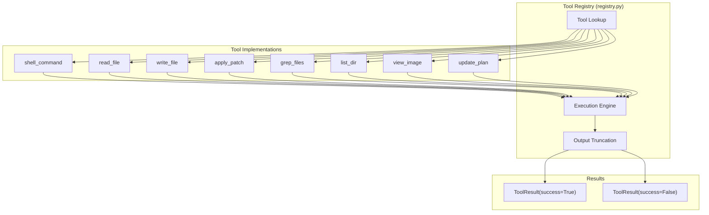
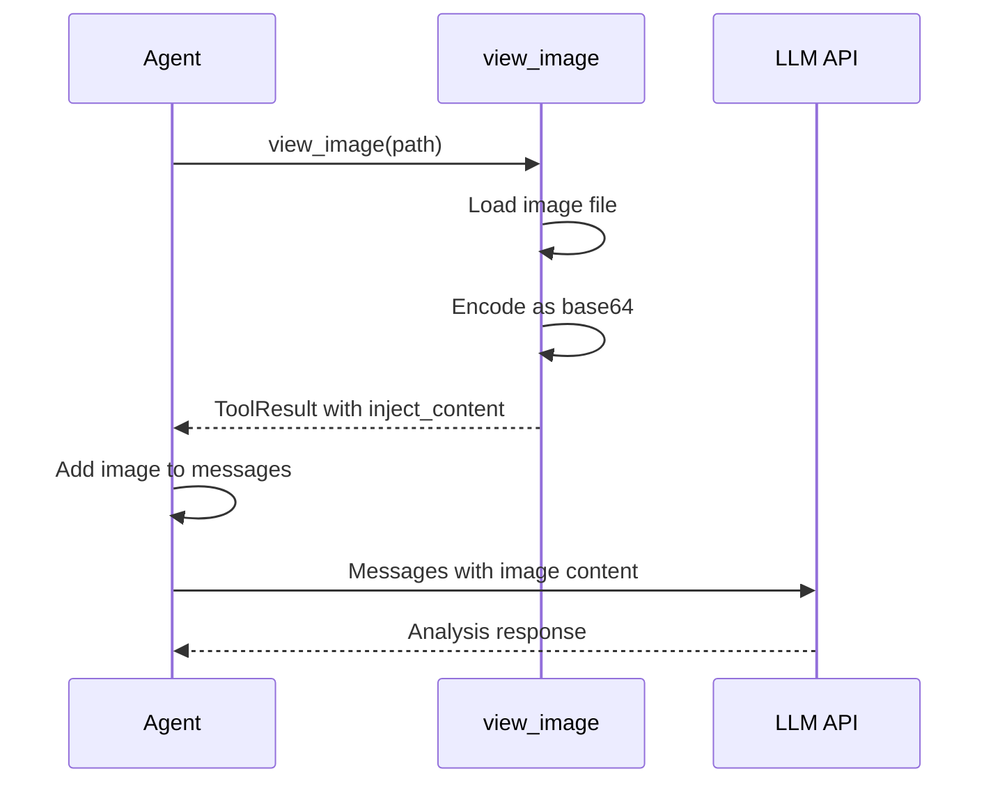
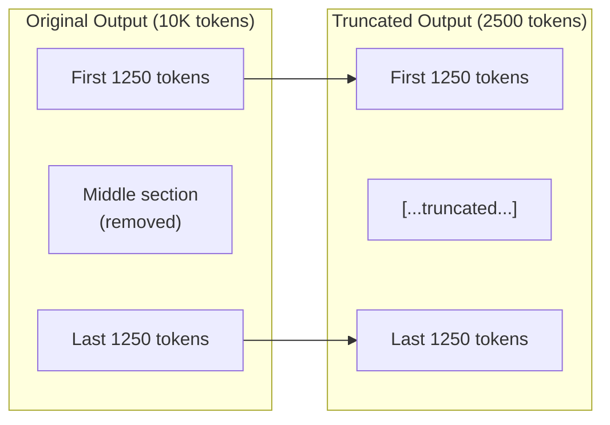
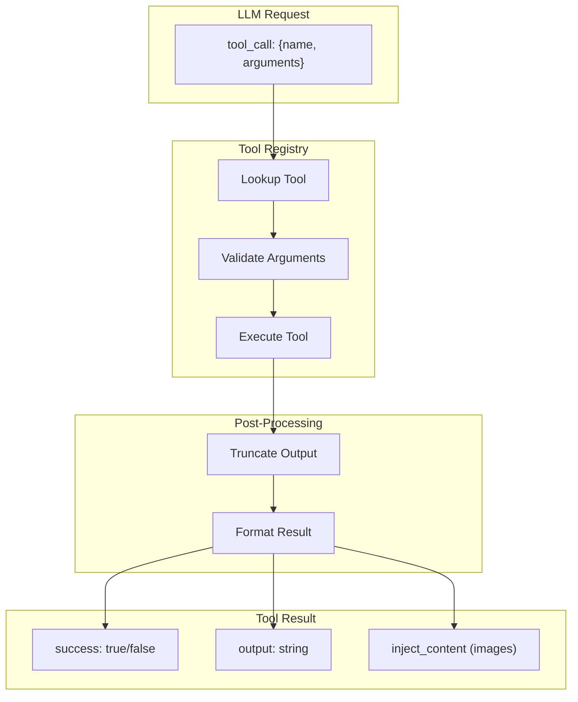

# Tools Reference

> **Complete documentation for all available tools in BaseAgent**

## Overview

BaseAgent provides eight specialized tools for autonomous task execution. Each tool is designed for a specific purpose and follows consistent patterns for input and output.

---

## Tool Summary

| Tool | Purpose | Key Parameters |
|------|---------|----------------|
| `shell_command` | Execute shell commands | `command`, `workdir`, `timeout_ms` |
| `read_file` | Read file contents | `file_path`, `offset`, `limit` |
| `write_file` | Create/overwrite files | `file_path`, `content` |
| `apply_patch` | Surgical file edits | `patch` |
| `grep_files` | Search file contents | `pattern`, `include`, `path` |
| `list_dir` | List directory contents | `dir_path`, `depth`, `limit` |
| `view_image` | Analyze images | `path` |
| `update_plan` | Track progress | `steps`, `explanation` |

---

## Tool Architecture



---

## shell_command

Execute shell commands in the terminal.

### Parameters

| Parameter | Type | Required | Default | Description |
|-----------|------|----------|---------|-------------|
| `command` | string | Yes | - | Shell command to execute |
| `workdir` | string | No | Current dir | Working directory |
| `timeout_ms` | number | No | 60000 | Timeout in milliseconds |

### Example Usage

```json
{
  "name": "shell_command",
  "arguments": {
    "command": "ls -la",
    "workdir": "/workspace",
    "timeout_ms": 30000
  }
}
```

### Best Practices

- Always set `workdir` to avoid directory confusion
- Use `rg` (ripgrep) instead of `grep` for faster searches
- Set appropriate timeouts for long-running commands
- Prefer specific commands over `cd && command`

### Output Format

```
total 40
drwxr-xr-x 7 root root 4096 Feb  3 13:16 .
drwxr-xr-x 1 root root 4096 Feb  3 12:00 ..
-rw-r--r-- 1 root root 5432 Feb  3 13:16 agent.py
drwxr-xr-x 4 root root 4096 Feb  3 13:16 src
```

---

## read_file

Read file contents with line numbers.

### Parameters

| Parameter | Type | Required | Default | Description |
|-----------|------|----------|---------|-------------|
| `file_path` | string | Yes | - | Path to the file |
| `offset` | number | No | 1 | Starting line (1-indexed) |
| `limit` | number | No | 2000 | Maximum lines to return |

### Example Usage

```json
{
  "name": "read_file",
  "arguments": {
    "file_path": "src/core/loop.py",
    "offset": 1,
    "limit": 100
  }
}
```

### Output Format

```
L1: """
L2: Main agent loop - the heart of the SuperAgent system.
L3: """
L4: 
L5: from __future__ import annotations
L6: import time
```

### Best Practices

- Use `offset` and `limit` for large files
- Prefer `grep_files` to find specific content first
- Read relevant sections, not entire large files

---

## write_file

Create or overwrite a file.

### Parameters

| Parameter | Type | Required | Default | Description |
|-----------|------|----------|---------|-------------|
| `file_path` | string | Yes | - | Path to the file |
| `content` | string | Yes | - | Content to write |

### Example Usage

```json
{
  "name": "write_file",
  "arguments": {
    "file_path": "hello.txt",
    "content": "Hello, World!\n"
  }
}
```

### Best Practices

- Use for new files or complete rewrites
- Prefer `apply_patch` for surgical edits
- Parent directories are created automatically
- Include trailing newlines for proper file endings

---

## apply_patch

Apply surgical file modifications using patch format.

### Parameters

| Parameter | Type | Required | Default | Description |
|-----------|------|----------|---------|-------------|
| `patch` | string | Yes | - | Patch content |

### Patch Format

```
*** Begin Patch
*** Add File: path/to/new/file.py
+line 1
+line 2
*** Update File: path/to/existing/file.py
@@ def existing_function():
-    old_line
+    new_line
*** Delete File: path/to/delete.py
*** End Patch
```

### Example Usage

```json
{
  "name": "apply_patch",
  "arguments": {
    "patch": "*** Begin Patch\n*** Update File: src/utils.py\n@@ def calculate(x):\n-    return x\n+    return x * 2\n*** End Patch"
  }
}
```

### Patch Rules

1. Use `@@ context line` to identify location
2. Prefix new lines with `+`
3. Prefix removed lines with `-`
4. Include 3 lines of context before and after changes
5. File paths must be relative (never absolute)

### Operations

| Operation | Format | Description |
|-----------|--------|-------------|
| Add file | `*** Add File: path` | Create new file |
| Update file | `*** Update File: path` | Modify existing file |
| Delete file | `*** Delete File: path` | Remove file |

---

## grep_files

Search file contents using patterns.

### Parameters

| Parameter | Type | Required | Default | Description |
|-----------|------|----------|---------|-------------|
| `pattern` | string | Yes | - | Regex pattern to search |
| `include` | string | No | - | Glob filter (e.g., `*.py`) |
| `path` | string | No | Current dir | Search path |
| `limit` | number | No | 100 | Max files to return |

### Example Usage

```json
{
  "name": "grep_files",
  "arguments": {
    "pattern": "def.*token",
    "include": "*.py",
    "path": "src/",
    "limit": 50
  }
}
```

### Output Format

```
src/llm/client.py
src/core/compaction.py
src/utils/truncate.py
```

### Best Practices

- Use ripgrep regex syntax
- Filter with `include` for faster searches
- Search specific directories when possible
- Results sorted by modification time

---

## list_dir

List directory contents with type indicators.

### Parameters

| Parameter | Type | Required | Default | Description |
|-----------|------|----------|---------|-------------|
| `dir_path` | string | Yes | - | Directory path |
| `offset` | number | No | 1 | Starting entry (1-indexed) |
| `limit` | number | No | 50 | Max entries to return |
| `depth` | number | No | 2 | Max directory depth |

### Example Usage

```json
{
  "name": "list_dir",
  "arguments": {
    "dir_path": "src/",
    "depth": 3,
    "limit": 100
  }
}
```

### Output Format

```
src/
  core/
    loop.py
    compaction.py
  llm/
    client.py
  tools/
    shell.py
    read_file.py
```

### Type Indicators

| Indicator | Meaning |
|-----------|---------|
| `/` | Directory |
| `@` | Symbolic link |
| (none) | Regular file |

---

## view_image

Load and analyze an image from the filesystem.

### Parameters

| Parameter | Type | Required | Default | Description |
|-----------|------|----------|---------|-------------|
| `path` | string | Yes | - | Path to image file |

### Supported Formats

- PNG
- JPEG
- GIF
- WebP
- BMP

### Example Usage

```json
{
  "name": "view_image",
  "arguments": {
    "path": "screenshots/error.png"
  }
}
```

### How It Works



### Best Practices

- Only use for images the user mentioned
- Don't use if image is already in conversation
- Large images are automatically resized
- Count as ~1000 tokens in context

---

## update_plan

Track task progress with a visible plan.

### Parameters

| Parameter | Type | Required | Default | Description |
|-----------|------|----------|---------|-------------|
| `steps` | array | Yes | - | List of step objects |
| `explanation` | string | No | - | Why the plan changed |

### Step Object

```json
{
  "description": "Create helper functions",
  "status": "completed"
}
```

### Status Values

| Status | Description |
|--------|-------------|
| `pending` | Not started |
| `in_progress` | Currently working |
| `completed` | Finished |

### Example Usage

```json
{
  "name": "update_plan",
  "arguments": {
    "steps": [
      {"description": "Read existing code", "status": "completed"},
      {"description": "Create helper module", "status": "in_progress"},
      {"description": "Write unit tests", "status": "pending"},
      {"description": "Update documentation", "status": "pending"}
    ],
    "explanation": "Starting implementation after code review"
  }
}
```

### Best Practices

- Keep descriptions to 5-7 words
- Mark steps completed as you go
- Update plan when approach changes
- Use for complex multi-step tasks

---

## Tool Output Limits

All tool outputs are truncated to prevent context overflow:

| Setting | Default | Description |
|---------|---------|-------------|
| `max_output_tokens` | 2500 | Maximum tokens per tool output |
| Truncation strategy | Middle-out | Keeps start and end, removes middle |

### Middle-Out Truncation



**Why middle-out?**
- Start contains headers, definitions
- End contains results, errors
- Middle is often repetitive

---

## Tool Execution Flow



---

## Next Steps

- [Usage Guide](./usage.md) - How to use the agent
- [Context Management](./context-management.md) - Memory optimization
- [Best Practices](./best-practices.md) - Effective tool usage
