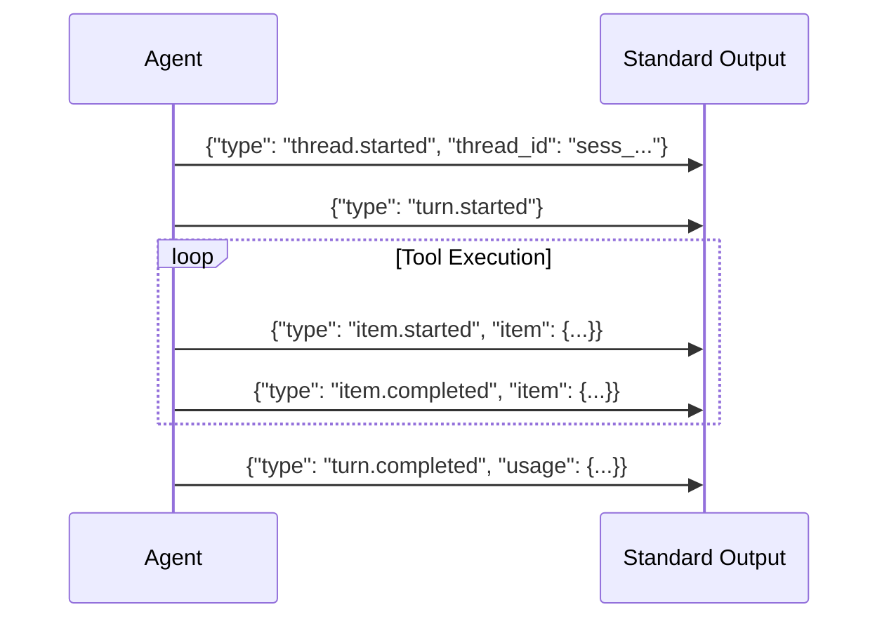
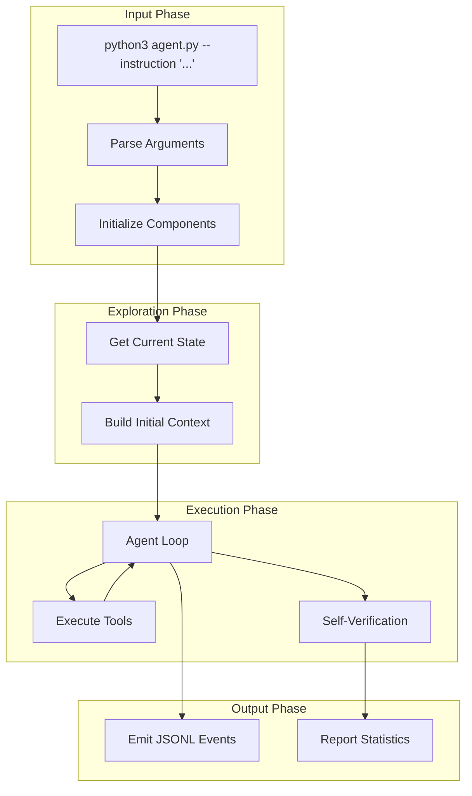
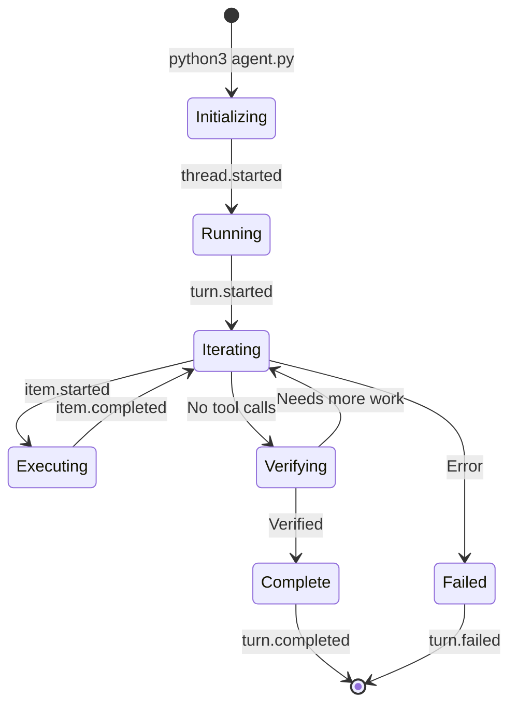

# Agent Usage Guide

> **Complete guide to running BaseAgent and interpreting its output**

## Command-Line Interface

### Basic Syntax

```bash
python3 agent.py --instruction "Your task description"
```

### Required Arguments

| Argument | Type | Description |
|----------|------|-------------|
| `--instruction` | string | The task for the agent to complete |

---

## Running the Agent

### Simple Tasks

```bash
# Create a file
python3 agent.py --instruction "Create a file called hello.txt with 'Hello, World!'"

# Read and explain code
python3 agent.py --instruction "Read src/core/loop.py and explain what it does"

# Find files
python3 agent.py --instruction "Find all Python files that contain 'import json'"
```

### Complex Tasks

```bash
# Multi-step task
python3 agent.py --instruction "Create a Python module in src/utils/helpers.py with functions for string manipulation, then write tests for it"

# Code modification
python3 agent.py --instruction "Add error handling to all functions in src/api/client.py that make HTTP requests"

# Investigation task
python3 agent.py --instruction "Find the bug causing the TypeError in the test output and fix it"
```

---

## Environment Variables

Configure the agent's behavior with environment variables:

```bash
# LLM Provider (Chutes)
export CHUTES_API_TOKEN="your-token"
export LLM_PROVIDER="chutes"
export LLM_MODEL="moonshotai/Kimi-K2.5-TEE"

# LLM Provider (OpenRouter)
export OPENROUTER_API_KEY="sk-or-v1-..."
export LLM_MODEL="openrouter/anthropic/claude-sonnet-4-20250514"

# Cost management
export LLM_COST_LIMIT="10.0"

# Run with inline variables
LLM_COST_LIMIT="5.0" python3 agent.py --instruction "..."
```

---

## Output Format

BaseAgent emits JSONL (JSON Lines) events to stdout:



### Event Types

| Event | Description |
|-------|-------------|
| `thread.started` | Session begins, includes unique thread ID |
| `turn.started` | Agent begins processing the instruction |
| `item.started` | A tool call is starting |
| `item.completed` | A tool call has completed |
| `turn.completed` | Agent finished, includes token usage |
| `turn.failed` | An error occurred |

### Example Output

```json
{"type": "thread.started", "thread_id": "sess_1706890123456"}
{"type": "turn.started"}
{"type": "item.started", "item": {"type": "command_execution", "id": "1", "command": "shell_command({command: 'ls -la'})", "status": "in_progress"}}
{"type": "item.completed", "item": {"type": "command_execution", "id": "1", "command": "shell_command", "status": "completed", "aggregated_output": "total 40\ndrwxr-xr-x...", "exit_code": 0}}
{"type": "item.completed", "item": {"type": "agent_message", "id": "2", "content": "I found the files. Now creating hello.txt..."}}
{"type": "item.started", "item": {"type": "command_execution", "id": "3", "command": "write_file({file_path: 'hello.txt', content: 'Hello, World!'})", "status": "in_progress"}}
{"type": "item.completed", "item": {"type": "command_execution", "id": "3", "command": "write_file", "status": "completed", "exit_code": 0}}
{"type": "turn.completed", "usage": {"input_tokens": 5432, "cached_input_tokens": 4890, "output_tokens": 256}}
```

---

## Logging Output

Agent logs go to stderr:

```
[14:30:15] [superagent] ============================================================
[14:30:15] [superagent] SuperAgent Starting (SDK 3.0 - litellm)
[14:30:15] [superagent] ============================================================
[14:30:15] [superagent] Model: openrouter/anthropic/claude-sonnet-4-20250514
[14:30:15] [superagent] Instruction: Create hello.txt with 'Hello World'...
[14:30:15] [loop] Getting initial state...
[14:30:16] [loop] Iteration 1/200
[14:30:16] [compaction] Context: 5432 tokens (3.2% of 168000)
[14:30:16] [loop] Prompt caching: 1 system + 2 final messages marked (3 breakpoints)
[14:30:17] [loop] Executing tool: write_file
[14:30:17] [loop] Iteration 2/200
[14:30:18] [loop] No tool calls in response
[14:30:18] [loop] Requesting self-verification before completion
```

### Separating Output Streams

```bash
# Send JSONL to file, logs to terminal
python3 agent.py --instruction "..." > output.jsonl

# Send logs to file, JSONL to terminal
python3 agent.py --instruction "..." 2> agent.log

# Both to separate files
python3 agent.py --instruction "..." > output.jsonl 2> agent.log
```

---

## Processing Output

### Parse JSONL with jq

```bash
# Get all completed items
python3 agent.py --instruction "..." | jq 'select(.type == "item.completed")'

# Get final usage stats
python3 agent.py --instruction "..." | jq 'select(.type == "turn.completed") | .usage'

# Get all agent messages
python3 agent.py --instruction "..." | jq 'select(.item.type == "agent_message") | .item.content'
```

### Parse with Python

```python
import json
import subprocess

# Run agent and capture output
result = subprocess.run(
    ["python3", "agent.py", "--instruction", "Your task"],
    capture_output=True,
    text=True
)

# Parse JSONL output
events = [json.loads(line) for line in result.stdout.strip().split('\n') if line]

# Find usage stats
for event in events:
    if event.get("type") == "turn.completed":
        print(f"Input tokens: {event['usage']['input_tokens']}")
        print(f"Output tokens: {event['usage']['output_tokens']}")
```

---

## Agent Workflow



---

## Example Tasks

### File Operations

```bash
# Create a file
python3 agent.py --instruction "Create config.yaml with database settings for PostgreSQL"

# Read and summarize
python3 agent.py --instruction "Read README.md and create a one-paragraph summary"

# Modify a file
python3 agent.py --instruction "Add a new function to src/utils.py that validates email addresses"
```

### Code Analysis

```bash
# Explain code
python3 agent.py --instruction "Explain how the authentication system works in src/auth/"

# Find patterns
python3 agent.py --instruction "Find all API endpoints and list them with their HTTP methods"

# Review code
python3 agent.py --instruction "Review src/api/handlers.py for potential security issues"
```

### Debugging

```bash
# Investigate error
python3 agent.py --instruction "Find why 'test_user_creation' is failing and fix it"

# Trace behavior
python3 agent.py --instruction "Trace the data flow from user input to database in the signup process"
```

### Project Tasks

```bash
# Setup
python3 agent.py --instruction "Create a Python project structure with src/, tests/, and setup.py"

# Add feature
python3 agent.py --instruction "Add logging to all functions in src/core/ using Python's logging module"

# Refactor
python3 agent.py --instruction "Refactor src/utils.py to follow the single responsibility principle"
```

---

## Session Management

Each agent run creates a new session with a unique ID:

```json
{"type": "thread.started", "thread_id": "sess_1706890123456"}
```

### Session Lifecycle



---

## Performance Tips

### Optimize Token Usage

```bash
# Set lower cost limit for testing
export LLM_COST_LIMIT="2.0"
```

### Monitor Progress

```bash
# Watch tool executions in real-time
python3 agent.py --instruction "..." 2>&1 | grep -E "Executing tool|Iteration"
```

### Debug Issues

```bash
# Full verbose output
python3 agent.py --instruction "..." 2>&1 | tee agent_debug.log
```

---

## Next Steps

- [Tools Reference](./tools.md) - Available tools and their parameters
- [Configuration](./configuration.md) - Customize agent behavior
- [Best Practices](./best-practices.md) - Tips for effective usage
