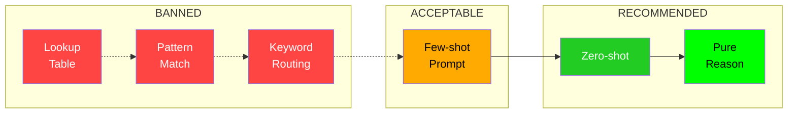

# 01 - What is a Generalist Agent?

## Definition

A **generalist agent** is an AI system that can solve arbitrary tasks through reasoning, without task-specific code paths or hardcoded behaviors. It relies entirely on:

1. **LLM reasoning** to understand and plan
2. **General-purpose tools** (shell, file I/O) to execute
3. **Iterative feedback** to verify and correct

In contrast, a **hardcoded agent** uses pattern matching, task-specific handlers, or pre-defined responses based on instruction content.

---

## The Core Distinction

### Generalist Agent (CORRECT)

```python
class GeneralistAgent(Agent):
    def run(self, ctx: Any):
        # Same code path for EVERY task
        context = self.explore(ctx)
        
        while not ctx.is_done:
            # LLM decides what to do
            response = self.llm.chat([
                {"role": "system", "content": SYSTEM_PROMPT},
                {"role": "user", "content": f"Task: {ctx.instruction}\n\nContext:\n{context}"}
            ])
            
            # Execute LLM's decision
            result = self.execute(ctx, response)
            
            # Update context with result
            context = result.output
            
            if response.task_complete:
                break
        
        # Task complete
```

### Hardcoded Agent (WRONG)

```python
class HardcodedAgent(Agent):
    def run(self, ctx: Any):
        instruction = ctx.instruction.lower()
        
        # WRONG: Task-specific routing
        if "create" in instruction and "file" in instruction:
            self.handle_file_creation(ctx)
        elif "compile" in instruction:
            self.handle_compilation(ctx)
        elif "git" in instruction:
            self.handle_git_task(ctx)
        else:
            self.handle_generic(ctx)
        
        # Task complete
```

---

## Why Generalist Agents Matter

### 1. Adaptability

A generalist agent can handle tasks it has never seen before. A hardcoded agent fails on any task outside its predefined categories.

| Task | Generalist | Hardcoded |
|------|------------|-----------|
| "Create hello.txt" | LLM reasons, executes | Matches "create" + "file" |
| "Implement FEAL cryptanalysis" | LLM reasons, executes | No handler, fails |
| "Fix the TypeScript error" | LLM reasons, executes | No handler, fails |

### 2. Robustness

Hardcoded agents are brittle:

```python
# This hardcoded check breaks on slight variations
if "create" in instruction and "file" in instruction:
    # Fails on: "Write a new file", "Generate output.txt", "Make a text document"
    pass
```

Generalist agents handle variations naturally because the LLM understands semantics.

### 3. Maintainability

Adding support for new task types:

- **Generalist**: No code changes needed
- **Hardcoded**: Add new handler, new keywords, new logic

---

## Characteristics of a Generalist Agent

### Must Have

| Characteristic | Description |
|----------------|-------------|
| Single code path | Same logic for all tasks |
| LLM-driven decisions | LLM chooses actions, not conditionals |
| No task keywords | Zero references to specific task content |
| Iterative execution | Observe-think-act loop |
| Dynamic planning | Plan emerges from LLM reasoning |

### Must NOT Have

| Anti-Pattern | Example |
|--------------|---------|
| Task detection | `if "file" in task` |
| Handler dispatch | `handlers[task_type](ctx)` |
| Keyword matching | `re.search(r"create|write|make", task)` |
| Cached responses | `return known_solutions[task_hash]` |
| Template injection | `code = TEMPLATES[detected_type]` |

---

## The Generalist Test

Ask yourself these questions about your agent:

1. **Would removing all knowledge of specific tasks break it?**
   - Generalist: No, it would still work
   - Hardcoded: Yes, it relies on task-specific code

2. **Does it have if-statements checking instruction content?**
   - Generalist: No
   - Hardcoded: Yes

3. **Could it solve a completely novel task type?**
   - Generalist: Yes, via LLM reasoning
   - Hardcoded: Only if a handler exists

4. **Is the code shorter than 500 lines for core logic?**
   - Generalist: Usually yes (simple loop + LLM)
   - Hardcoded: Often much longer (many handlers)

---

## Real-World Example: Terminus-2

The Terminus-2 agent demonstrates generalist design:

```python
class Terminus2Agent(Agent):
    def run(self, ctx: Any):
        # Build initial context (same for ALL tasks)
        terminal_state = shell("pwd && ls -la").output
        
        self.history = [
            {"role": "system", "content": SYSTEM_PROMPT},
            {"role": "user", "content": f"Task: {ctx.instruction}\n\nTerminal:\n{terminal_state}"}
        ]
        
        # Main loop (same for ALL tasks)
        while True:
            response = self.llm.chat(self.history[-20:])
            result = self.parser.parse_response(response.text)
            
            if result.is_task_complete:
                break
            
            # Execute whatever commands LLM decided
            output = self.execute_commands(ctx, result.commands)
            self.history.append({"role": "user", "content": output})
        
        # Task complete
```

Key observations:
- **No task-specific code**: Works on any task
- **LLM decides commands**: No hardcoded command sequences
- **Generic loop**: Same structure regardless of task type

---

## The Spectrum of Generalization



- **Lookup Table**: Pre-computed solutions indexed by task
- **Pattern Match**: Regex on instructions
- **Keyword Routing**: If-else based on keywords
- **Few-shot**: Examples in prompt (acceptable if generic)
- **Zero-shot**: Direct instruction to LLM
- **Pure Reason**: LLM with tools, no examples needed

---

## Summary

| Aspect | Generalist | Hardcoded |
|--------|------------|-----------|
| Task handling | Uniform | Task-specific |
| Decision making | LLM | Conditionals |
| Novel tasks | Handles | Fails |
| Code complexity | Low | High |
| Maintenance | Easy | Difficult |
| **Verdict** | **USE THIS** | **AVOID** |

The goal is to build agents that **think**, not agents that **match patterns**.
