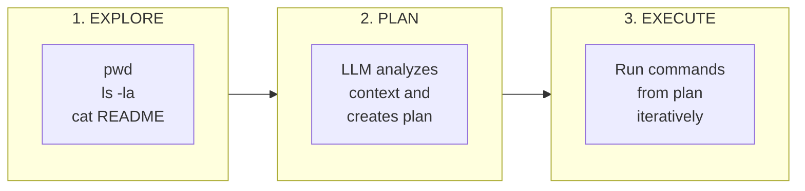
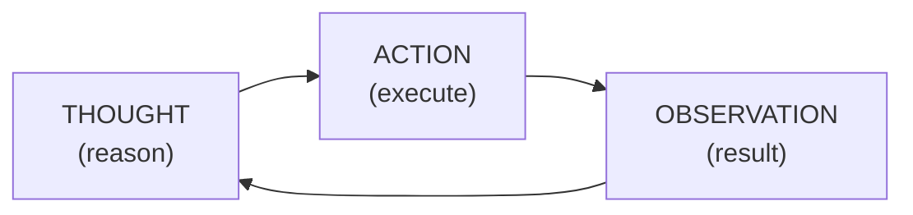
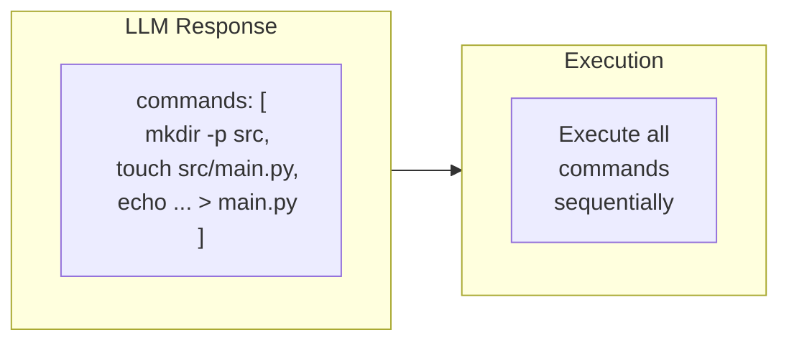
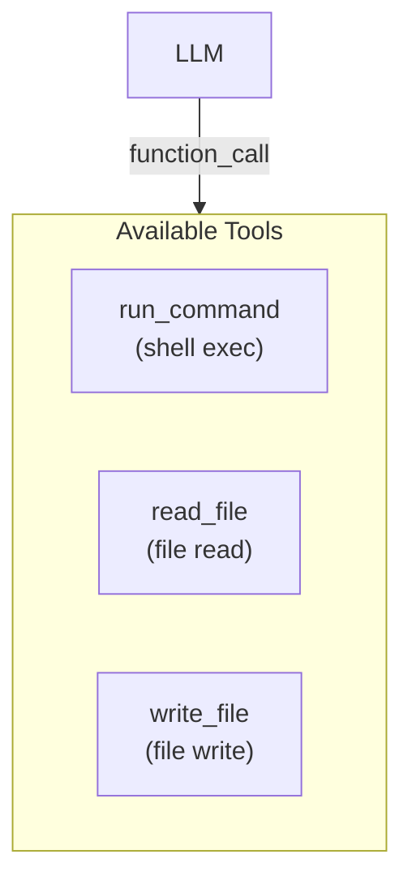
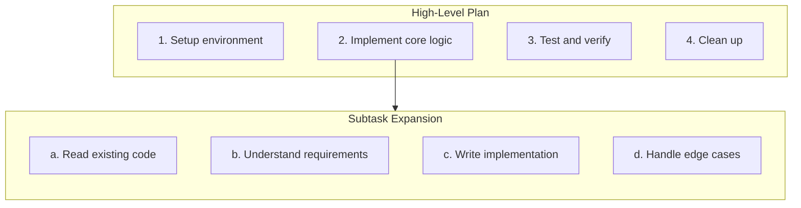
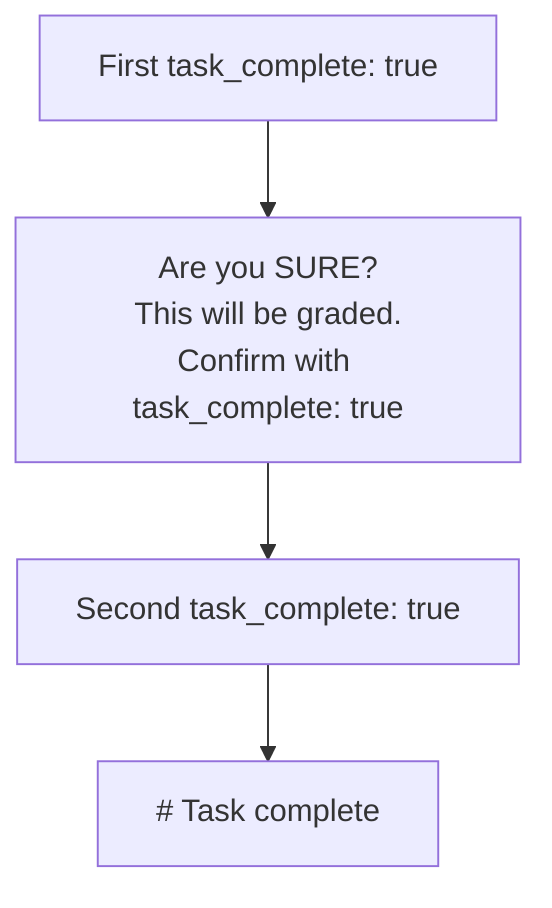

# 02 - Architecture Patterns

This document covers proven architecture patterns for building generalist agents. These patterns form the foundation of effective agent design.

---

## MANDATORY RULES (SDK 3.0)

> **CRITICAL**: These rules are MANDATORY for all agents.

### 1. Project Structure (MANDATORY)

Agents **MUST** be structured projects, **NOT** single files:

```
my-agent/
├── agent.py              # Entry point with --instruction
├── src/                  # Modules
│   ├── core/
│   │   ├── loop.py       # Main loop
│   │   └── compaction.py # Context management (MANDATORY)
│   ├── llm/
│   │   └── client.py     # LLM client (Chutes API)
│   └── tools/
│       └── ...           # Tools
├── requirements.txt      # Dependencies
└── pyproject.toml        # Configuration
```

**Why?**
- Maintainability and testability
- Separation of concerns
- Code reuse
- Easier debugging

### 2. Session Management (MANDATORY)

Agents **MUST** maintain complete conversation history:

```python
# CORRECT: Full history
messages = [
    {"role": "system", "content": system_prompt},
    {"role": "user", "content": instruction},
]

while not done:
    response = llm.chat(messages)
    messages.append({"role": "assistant", "content": response.text})
    
    for tool_call in response.function_calls:
        result = execute_tool(tool_call)
        messages.append({"role": "tool", "tool_call_id": tool_call.id, "content": result})

# FORBIDDEN: Context lost between calls
response = llm.chat([{"role": "user", "content": instruction}])  # NO memory!
```

### 3. Context Compaction (MANDATORY)

Compaction is **CRITICAL** for performance and reliability.

**Why it's mandatory:**
- Prevents "context too long" errors
- Preserves critical information
- Enables complex multi-step tasks
- Improves response coherence

**Required implementation:**

```python
# Recommended constants
MODEL_CONTEXT_LIMIT = 200_000  # Model context window
AUTO_COMPACT_THRESHOLD = 0.85  # 85% = trigger compaction
PRUNE_PROTECT = 40_000         # Protect 40K recent tokens
PRUNE_MINIMUM = 20_000         # Minimum to recover

def manage_context(messages, llm):
    total_tokens = estimate_tokens(messages)
    
    # Check if compaction needed
    if total_tokens > MODEL_CONTEXT_LIMIT * AUTO_COMPACT_THRESHOLD:
        # Step 1: Prune old tool outputs
        messages = prune_old_tool_outputs(messages)
        
        # Step 2: AI compaction if insufficient
        if estimate_tokens(messages) > MODEL_CONTEXT_LIMIT * AUTO_COMPACT_THRESHOLD:
            messages = ai_compact(messages, llm)
    
    return messages
```

---

## Pattern 1: Explore-Plan-Execute (EPE)

The most fundamental pattern. Every task should follow this sequence:



### Implementation

```python
def run(self, ctx):
    # 1. EXPLORE - Gather context
    explore_results = []
    explore_results.append(shell("pwd").output)
    explore_results.append(shell("ls -la").output)
    explore_results.append(shell("cat README.md 2>/dev/null || echo 'No README'").output)
    
    context = "\n".join(explore_results)
    
    # 2. PLAN - Let LLM analyze and plan
    messages = [
        {"role": "system", "content": "You are a planning assistant."},
        {"role": "user", "content": f"Task: {ctx.instruction}\n\nEnvironment:\n{context}"}
    ]
    response = self.llm.chat(messages)
    
    # 3. EXECUTE - Implement the plan
    self.execute_plan(ctx, response.text)
    
    # Task complete
```

### When to Use

- **Always** as the initial approach to any task
- When you need to understand the environment before acting
- For complex tasks requiring multi-step solutions

---

## Pattern 2: ReAct (Reasoning + Acting)

Interleave reasoning and action in a tight loop:



### Implementation

```python
REACT_PROMPT = """You are an agent solving tasks. For each step:
1. THOUGHT: Analyze the current situation
2. ACTION: Decide what command to run
3. Wait for OBSERVATION (command output)
4. Repeat until task is complete

Respond with JSON:
{
    "thought": "your reasoning here",
    "action": "shell command to run",
    "task_complete": false
}"""

def run(self, ctx: Any):
    messages = [
        {"role": "system", "content": REACT_PROMPT},
        {"role": "user", "content": f"Task: {ctx.instruction}"}
    ]
    
    while ctx.step < 100:
        response = self.llm.chat(messages)
        data = response.json()
        
        if data.get("task_complete"):
            break
        
        # Execute action
        action = data.get("action")
        if action:
            result = shell(action)
            observation = f"OBSERVATION:\n{result.output[-3000:]}"
            
            messages.append({"role": "assistant", "content": response.text})
            messages.append({"role": "user", "content": observation})
    
    # Task complete
```

### When to Use

- Tasks requiring iterative refinement
- When you can't plan everything upfront
- Debugging and troubleshooting scenarios

---

## Pattern 3: Batch Command Execution

Execute multiple commands per LLM call for efficiency:



### Implementation (Terminus-2 Style)

```python
BATCH_PROMPT = """Respond with JSON containing multiple commands:
{
    "analysis": "what you observe",
    "plan": "what you will do",
    "commands": [
        {"keystrokes": "command1", "duration": 0.1},
        {"keystrokes": "command2", "duration": 1.0}
    ],
    "task_complete": false
}"""

def execute_batch(self, ctx: Any, commands: list) -> str:
    outputs = []
    
    for cmd in commands:
        result = shell(cmd["keystrokes"], timeout=int(cmd.get("duration", 1) * 60))
        output = f"$ {cmd['keystrokes']}\n{result.output}"
        
        if result.exit_code != 0:
            output += f"\n[exit code: {result.exit_code}]"
        
        outputs.append(output)
        
        if result.timed_out:
            outputs.append("[TIMEOUT]")
            break
    
    return "\n\n".join(outputs)
```

### When to Use

- When efficiency matters (fewer LLM calls)
- For well-understood sequences of operations
- When commands are independent

---

## Pattern 4: Tool-Augmented Reasoning

Give the LLM explicit tools to call:



### Implementation

```python
# Tool definition (OpenAI-compatible format)
TOOLS = [
    {
        "name": "run_command",
        "description": "Execute a shell command",
        "parameters": {
            "type": "object",
            "properties": {
                "command": {"type": "string", "description": "Shell command to run"}
            },
            "required": ["command"]
        }
    },
    {
        "name": "read_file",
        "description": "Read contents of a file",
        "parameters": {
            "type": "object",
            "properties": {
                "path": {"type": "string", "description": "File path to read"}
            },
            "required": ["path"]
        }
    },
    {
        "name": "write_file",
        "description": "Write content to a file",
        "parameters": {
            "type": "object",
            "properties": {
                "path": {"type": "string", "description": "File path"},
                "content": {"type": "string", "description": "Content to write"}
            },
            "required": ["path", "content"]
        }
    }
]

def run(self, ctx):
    messages = [
        {"role": "system", "content": "You are a task-solving agent with tools."},
        {"role": "user", "content": ctx.instruction}
    ]
    
    while not ctx.is_done:
        response = self.llm.chat(messages, tools=TOOLS)
        messages.append({"role": "assistant", "content": response.text})
        
        for call in response.function_calls:
            result = self.execute_tool(ctx, call.name, call.arguments)
            messages.append({"role": "tool", "tool_call_id": call.id, "content": result})
    
    # Task complete
```

### When to Use

- When you want structured tool interactions
- For complex agents with many capabilities
- When you need clear separation of concerns

---

## Pattern 5: Hierarchical Planning

Break complex tasks into subtasks:



### Implementation

```python
def run(self, ctx: Any):
    # Get high-level plan
    high_level = self.llm.ask(
        f"Task: {ctx.instruction}\n\n"
        "Break this into 3-5 high-level steps. Be concise.",
        system="You are a planning assistant."
    )
    
    steps = self.parse_steps(high_level.text)
    
    for i, step in enumerate(steps):
        print(f"Step {i+1}/{len(steps)}: {step[:50]}...")
        
        # Expand step into detailed actions
        detailed = self.llm.ask(
            f"Current step: {step}\n\n"
            f"Original task: {ctx.instruction}\n\n"
            "What specific commands should I run?",
            system="You are an execution assistant. Provide shell commands."
        )
        
        # Execute detailed plan
        self.execute_step(ctx, detailed)
    
    # Task complete
```

### When to Use

- Very complex tasks with many parts
- Tasks requiring different types of expertise
- When simple linear planning isn't sufficient

---

## Pattern 6: Double Confirmation for Completion

Never mark complete without verification:



### Implementation (Terminus-2 Style)

```python
CONFIRM_MESSAGE = """Current terminal state:
{terminal_output}

Are you sure you want to mark the task as complete? 
This will trigger grading and you won't be able to make corrections.
If so, include "task_complete": true in your response again."""

def run(self, ctx: Any):
    pending_completion = False
    
    while True:
        response = self.llm.chat(self.history)
        result = self.parse(response.text)
        
        if result.task_complete:
            if pending_completion:
                # Second confirmation - actually complete
                break
            else:
                # First signal - ask for confirmation
                pending_completion = True
                terminal_state = shell("pwd && ls -la").output
                self.history.append({
                    "role": "user",
                    "content": CONFIRM_MESSAGE.format(terminal_output=terminal_state)
                })
                continue
        else:
            pending_completion = False
        
        # Normal execution...
    
    # Task complete
```

### When to Use

- **Always** for task completion
- Prevents premature completion
- Gives LLM chance to reconsider

---

## Choosing the Right Pattern

| Scenario | Recommended Pattern |
|----------|---------------------|
| Simple, well-defined tasks | EPE |
| Debugging, troubleshooting | ReAct |
| Efficiency-critical | Batch Execution |
| Complex multi-tool tasks | Tool-Augmented |
| Very large tasks | Hierarchical |
| Any completion | Double Confirmation |

---

## Combining Patterns

Most effective agents combine multiple patterns:

```python
class AdvancedAgent(Agent):
    def run(self, ctx: Any):
        # EPE: Explore first
        context = self.explore(ctx)
        
        # Hierarchical: Plan at high level
        plan = self.create_high_level_plan(ctx.instruction, context)
        
        for step in plan:
            # ReAct: Execute each step iteratively
            self.execute_with_react(ctx, step)
        
        # Double Confirmation: Verify before done
        if self.confirm_completion(ctx):
            # Task complete
```

The key is using the right pattern for each phase of the task.
