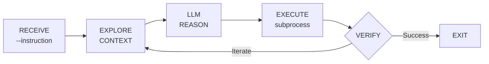

# Generalist Agent Best Practices Guide

> **For Subnet 100 Miners and General AI Agent Developers**

This guide provides comprehensive best practices for building **generalist AI agents** that solve arbitrary tasks through reasoning rather than pattern matching. These principles apply to Subnet 100 (Terminal Bench) and any system requiring adaptive problem-solving.

---

## Table of Contents

| File | Topic | Description |
|------|-------|-------------|
| [01-what-is-generalist-agent.md](01-what-is-generalist-agent.md) | Definitions | What makes an agent "generalist" vs "hardcoded" |
| [02-architecture-patterns.md](02-architecture-patterns.md) | Architecture | Explore-Plan-Execute, ReAct, LLM loops |
| [03-allowed-vs-forbidden.md](03-allowed-vs-forbidden.md) | Rules | What's allowed vs prohibited |
| [04-anti-patterns.md](04-anti-patterns.md) | Anti-Patterns | 30+ examples of what NOT to do |
| [05-best-practices.md](05-best-practices.md) | Best Practices | Good patterns with code examples |
| [06-llm-usage-guide.md](06-llm-usage-guide.md) | LLM Usage | Prompting, context management, function calling |
| [07-tool-design.md](07-tool-design.md) | Tool Design | How to design effective tools |
| [08-error-handling.md](08-error-handling.md) | Error Handling | Recovery strategies and retry logic |
| [09-testing-your-agent.md](09-testing-your-agent.md) | Testing | Local testing before submission |
| [10-checklist.md](10-checklist.md) | Checklist | Pre-submission validation checklist |

---

## The 5 Golden Rules

These are the fundamental principles that separate successful generalist agents from failing hardcoded ones:

### Rule 1: Let the LLM Reason About Every Task

```
WRONG: if "create file" in task: run_file_creation()
RIGHT: response = llm.chat([{"role": "user", "content": f"Task: {task}\nWhat commands should I run?"}])
```

The LLM must analyze each task independently. No shortcuts, no pattern matching on instructions.

### Rule 2: Never Match on Task Content

Your agent should have **zero knowledge** of specific tasks. It should not contain:
- Keywords from task descriptions
- Task-specific handlers
- Conditional logic based on instruction content

### Rule 3: Explore Before Acting

Always gather context before executing:

```python
import subprocess

def shell(cmd, cwd=None, timeout=60):
    """Execute shell command using subprocess."""
    result = subprocess.run(cmd, shell=True, capture_output=True, text=True, cwd=cwd, timeout=timeout)
    return result.stdout + result.stderr

# 1. EXPLORE
context = shell("pwd && ls -la")
readme = shell("cat README.md 2>/dev/null")

# 2. PLAN (via LLM)
messages = [{"role": "user", "content": f"Environment:\n{context}\n\nTask: {task}"}]
response = llm.chat(messages)

# 3. EXECUTE
for command in parse_commands(response.text):
    shell(command)
```

### Rule 4: Verify Every Output

Before marking a task complete:

```python
# Verify output file exists
result = shell(f"ls -la {output_path}")
if "No such file" in result:
    # File doesn't exist - don't mark complete!
    continue_working()

# Verify content is correct
content = shell(f"cat {output_path}")
# Let LLM verify if content meets requirements
```

### Rule 5: Always Signal Completion

Every execution path must signal completion. The agent entry point receives `--instruction` and must complete:

```python
import argparse
import subprocess

def main():
    parser = argparse.ArgumentParser()
    parser.add_argument("--instruction", required=True)
    args = parser.parse_args()
    
    try:
        # ... task execution ...
        
        if task_successful:
            print("[DONE] Task completed successfully")
        else:
            print("[DONE] Task failed")
            
    except Exception as e:
        print(f"[ERROR] {e}")
    
    # Agent exits naturally - no special done() call needed

if __name__ == "__main__":
    main()
```

**Warning**: Agents that run indefinitely will timeout and receive zero score.

---

## Quick Reference: Common Failure Modes

| Failure | Cause | Prevention |
|---------|-------|------------|
| Infinite loop | No exit condition | Set max iterations, always have escape |
| Missing output file | Wrong path or not created | Use absolute paths, verify with `ls -la` |
| Constraint violation | Didn't read constraints | Parse constraints FIRST |
| Timeout | Task takes too long | Monitor time, prioritize critical steps |
| Context overflow | Too much history | Implement compaction (MANDATORY) |

---

## Quick Start

1. **Read** [01-what-is-generalist-agent.md](01-what-is-generalist-agent.md) to understand the core concepts
2. **Study** [04-anti-patterns.md](04-anti-patterns.md) to learn what NOT to do
3. **Implement** patterns from [05-best-practices.md](05-best-practices.md)
4. **Validate** using [10-checklist.md](10-checklist.md) before submission

---

## Architecture Overview



---

## Key Insight

> **A generalist agent treats every task as if it has never seen it before.**
> 
> It uses the LLM to understand, plan, and execute - never hardcoded logic.
> The same agent code should work on ANY task, from "create a file" to 
> "implement a path tracer" to "compile a Coq proof".

---

## Document Version

- **Version**: 2.0 (SDK 3.0 Compatible)
- **Last Updated**: January 2025
- **Target**: Subnet 100 / Terminal Bench v2.0
